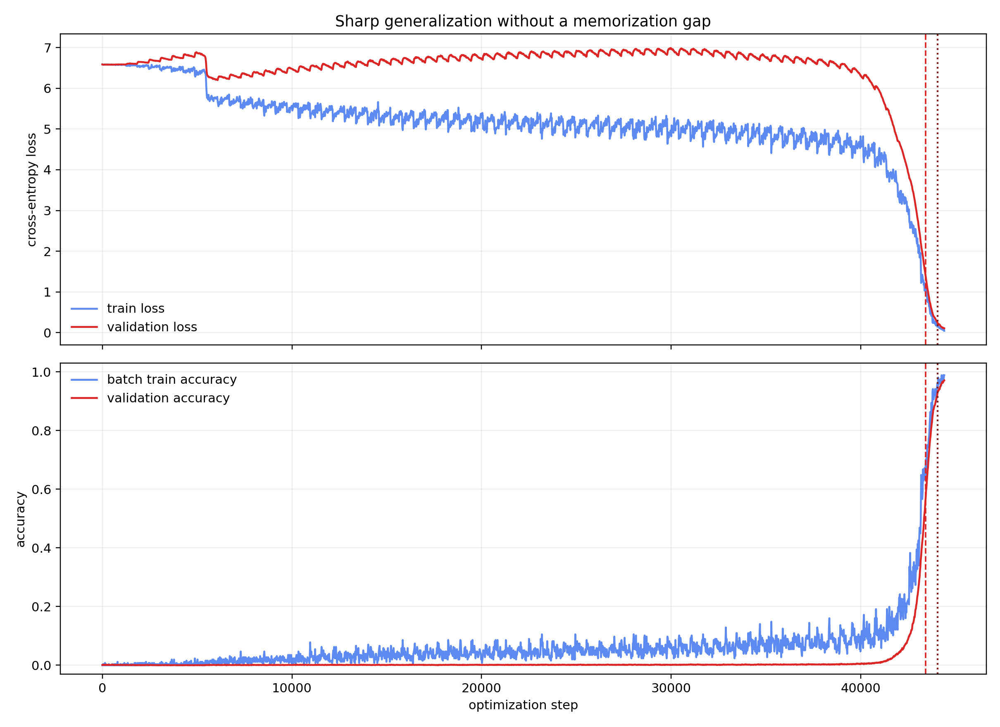
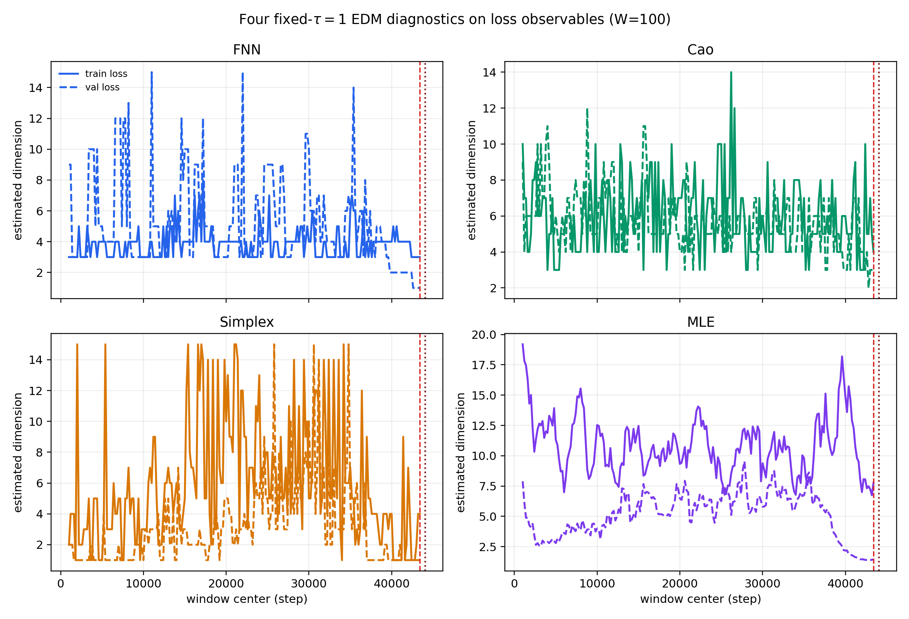
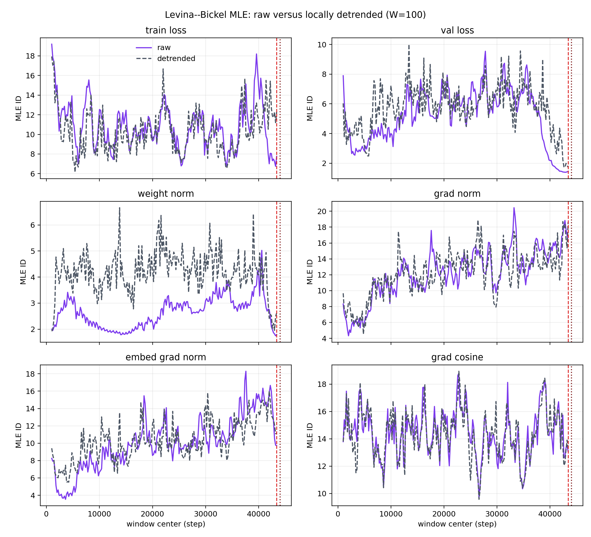
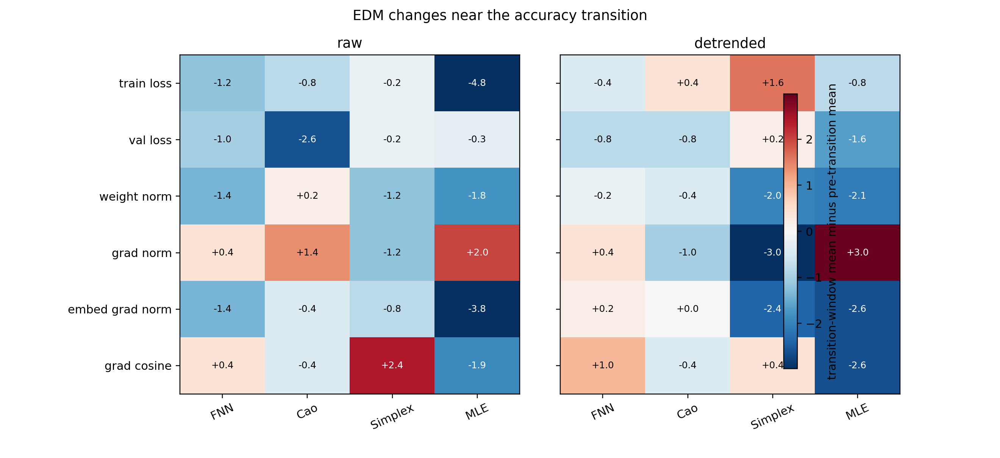
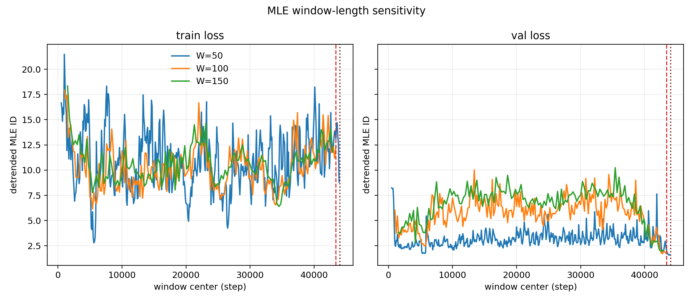

# EDM-анализ резкой генерализации без memorization gap

## Итог

Лог `training_log.csv` содержит 2221 наблюдение с интервалом 20 шагов,
охватывающих шаги 0--44400. Train- и validation-accuracy растут практически
синхронно:

| Событие, 5 последовательных логов | Шаг |
|---|---:|
| Validation accuracy $\ge 0.50$ | 43420 |
| Validation accuracy $\ge 0.90$ | 44040 |
| Batch train accuracy $\ge 0.95$ | 44160 |
| Validation accuracy $\ge 0.95$ | 44300 |

Таким образом, validation достигает 0.90 на 120 шагов **раньше**, чем batch
train достигает 0.95. Это не grokking с отложенной генерализацией, а резкий
совместный переход обучения и обобщения.

Главный EDM-вывод: переход сопровождается выраженной, но
**observable-dependent** перестройкой. Наиболее устойчивый к длине окна сигнал
--- падение detrended MLE для validation loss; одновременно detrended MLE общей
gradient norm растёт. Поэтому результат нельзя описать как универсальный
dimensionality collapse всей динамики.

## Методика

- фиксированная задержка `tau=1`;
- основное окно: 100 лог-точек = 2000 optimizer steps;
- stride: 10 лог-точек = 200 optimizer steps;
- `E_max=15`, MLE с пятью соседями;
- четыре legacy-метода проекта: FNN, Cao, Simplex, Levina--Bickel MLE;
- отдельно анализируются raw и локально линейно detrended ряды;
- метрики: `train_loss`, `val_loss`, `weight_norm`, `grad_norm`,
  `embed_grad_norm`, `grad_cosine`.

Для MLE дополнительно проверены окна 50, 100 и 150 лог-точек. Последнее полное
окно `W=100` заканчивается на шаге 44400. После устойчивого достижения
validation accuracy 0.95 остаётся только 6 лог-точек, поэтому отдельная
post-transition фазовая реконструкция невозможна. Последние окна неизбежно
смешивают подход к переходу и сам переход.

## Четыре метода на loss

В таблице сравниваются средние последних пяти полностью пред-переходных окон и
последних пяти окон, пересекающих переход. Значение равно transition minus pre.

| Метрика | Метод | Raw $\Delta$ | Detrended $\Delta$ |
|---|---|---:|---:|
| Train loss | FNN | -1.20 | -0.40 |
| Train loss | Cao | -0.80 | +0.40 |
| Train loss | Simplex | -0.20 | +1.60 |
| Train loss | MLE | -4.78 | -0.77 |
| Validation loss | FNN | -1.00 | -0.80 |
| Validation loss | Cao | -2.60 | -0.80 |
| Validation loss | Simplex | -0.20 | +0.20 |
| Validation loss | MLE | -0.30 | -1.65 |

Raw train-loss MLE резко снижается, но после detrending эффект становится
намного слабее. Следовательно, значительная часть raw-сигнала связана с формой
быстрого падения loss. Для validation loss снижение detrended MLE сохраняется.

## MLE по всем наблюдаемым

Для основного окна `W=100`:

| Метрика | Raw: pre $\to$ transition | Detrended: pre $\to$ transition |
|---|---:|---:|
| Train loss | 12.09 $\to$ 7.31 | 12.64 $\to$ 11.87 |
| Validation loss | 1.72 $\to$ 1.42 | 3.46 $\to$ 1.81 |
| Weight norm | 3.64 $\to$ 1.84 | 4.36 $\to$ 2.26 |
| Gradient norm | 15.58 $\to$ 17.61 | 14.41 $\to$ 17.37 |
| Embedding-gradient norm | 15.16 $\to$ 11.36 | 14.63 $\to$ 12.01 |
| Gradient cosine | 14.97 $\to$ 13.04 | 15.54 $\to$ 12.92 |

Особенно важен противоположный знак gradient norm: общая амплитуда градиента
при переходе становится геометрически более сложной по MLE, даже когда loss и
несколько других наблюдаемых упрощаются.

## Устойчивость к длине окна

Detrended MLE transition-minus-pre:

| Метрика | W=50 | W=100 | W=150 | Устойчивый знак |
|---|---:|---:|---:|:---:|
| Validation loss | -2.65 | -1.65 | -1.78 | да |
| Gradient norm | +5.51 | +2.96 | +2.30 | да |
| Train loss | +1.87 | -0.77 | +1.42 | нет |
| Weight norm | +1.09 | -2.09 | -2.64 | нет |
| Embedding-gradient norm | -1.89 | -2.62 | -0.58 | да |
| Gradient cosine | -3.36 | -2.62 | +0.43 | нет |

Это оставляет два наиболее надёжных и противоположных эффекта: упрощение
validation-loss траектории и усложнение gradient-norm траектории.

## Ограничения

1. После перехода недостаточно точек для отдельной post-transition фазы.
2. Скользящие окна перекрываются на 90% и не являются независимыми повторами.
3. Legacy nearest-neighbour методы не используют Theiler exclusion.
4. 141 raw и 113 detrended MLE-оценок превышают `E_max=15`; максимумы равны
   20.44 и 18.94. Это выход legacy-эвристики, а не буквальная intrinsic
   dimension 15-мерного embedding.
5. Simplex выбирает границу `E=15` редко для большинства метрик, но примерно в
   16.4% raw окон gradient cosine.
6. Имеется один запуск и один seed; вывод описательный.

## Вывод для статьи

Этот контроль показывает, что резкое обобщение не требует длительного
memorization gap и всё же может сопровождаться выраженной EDM-перестройкой.
Однако эта перестройка не является единым коллапсом размерности: разные
наблюдаемые меняются в разных направлениях. Поэтому EDM-сигнал разумнее
интерпретировать как маркер смены режима оптимизационной динамики, а не как
универсальный скалярный порядок grokking.

Воспроизводимые артефакты находятся в `results_tau1_no_gap/`, исходный скрипт
--- `analyze_sharp_no_gap_edm.py`.
