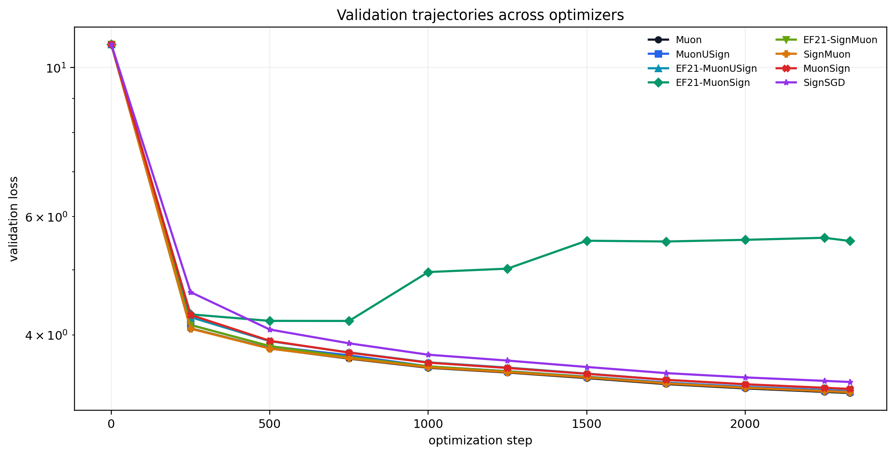
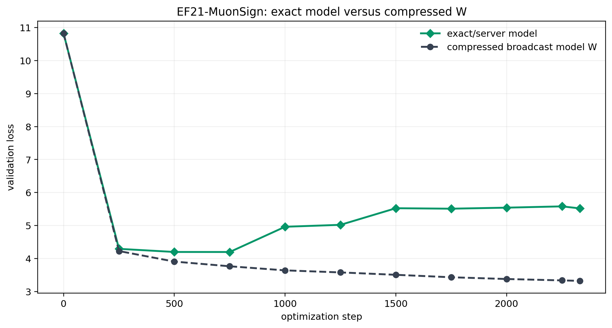
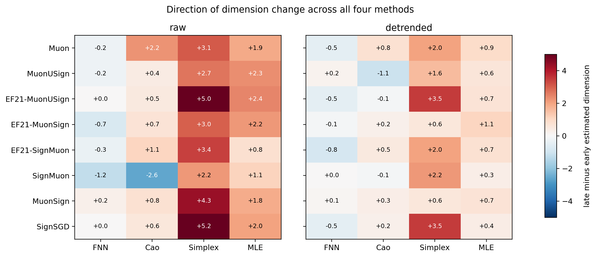
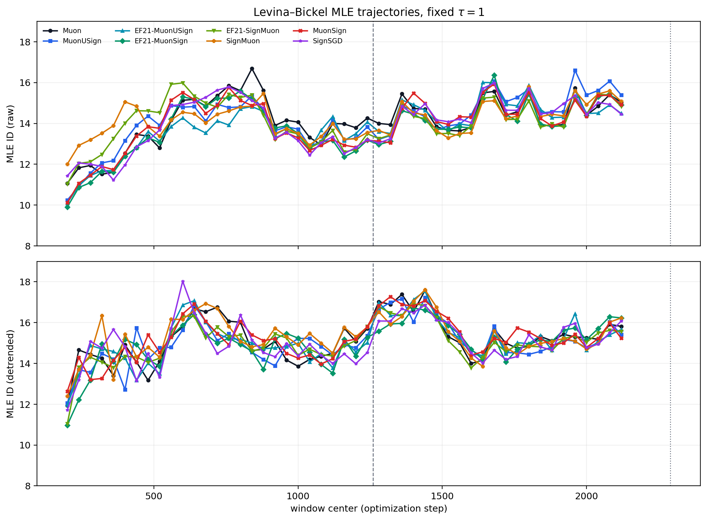
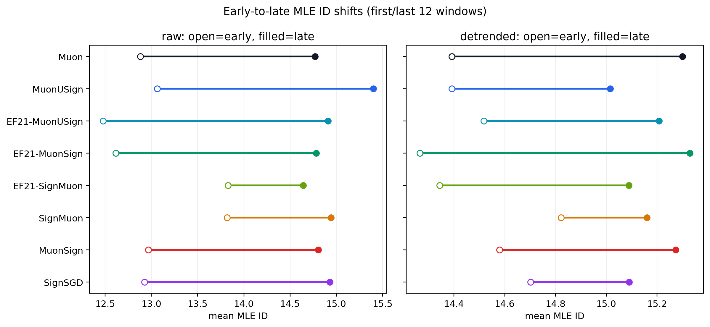
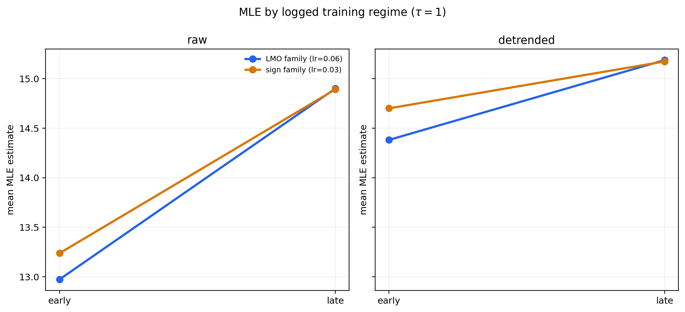

# Итоговый сравнительный отчёт: режимы обучения nanoGPT и EDM при $\tau=1$

## Краткий вывод

Восемь добавленных логов повторно распарсены и проанализированы единым конвейером. Все запуски завершены, каждый содержит 2330 последовательных значений training loss и 11 точек validation loss. Для каждого ряда построено 49 скользящих окон длиной 400 шагов со stride 40; во всех окнах использованы FNN, Cao, simplex projection и Levina–Bickel MLE при фиксированном `tau=1`, отдельно для raw и локально линейно detrended loss.

Главный результат: **ни один из двух режимов не показывает согласованного позднего коллапса размерности**. FNN в среднем слегка уменьшается, но simplex и MLE растут во всех восьми запусках; Cao зависит от режима и detrending. Логи образуют два режима: `lmo` при `lr=0.06` (5 методов) и `sign` при `lr=0.03` (3 метода). Сравнение описательное: одновременно меняются семейство оптимизатора и learning rate, а на метод есть один запуск.

## Данные и единая методика

- наблюдаемая величина: нормализованный token-level `train_loss_per_token`;
- `tau=1`, окно 400 шагов, stride 40, 49 окон на запуск;
- максимальная embedding dimension `E_max=15`;
- MLE: Levina–Bickel, `k=5` ближайших соседей;
- early/late: средние по первым/последним 12 окнам;
- validation loss используется как внешний показатель качества;
- raw и detrended ряды анализируются раздельно.

Последнее EDM-окно имеет центр 2120, поэтому 40-шаговый extension, начинающийся на шаге 2290, данным оконным анализом не изолируется.

## Итоги отдельных запусков

| Оптимизатор | Режим | LR | Final val | Best val | Время, s |
|---|---|---:|---:|---:|---:|
| Muon | lmo | 0.06 | 3.2785 | 3.2785 | 143.8 |
| MuonUSign | lmo | 0.06 | 3.2959 | 3.2959 | 143.6 |
| EF21-MuonUSign | lmo | 0.06 | 3.3203 | 3.3203 | 144.5 |
| EF21-MuonSign | lmo | 0.06 | 5.5198 | 4.1967 | 144.6 |
| EF21-SignMuon | lmo | 0.06 | 3.2860 | 3.2860 | 144.5 |
| SignMuon | sign | 0.03 | 3.2881 | 3.2881 | 144.3 |
| MuonSign | sign | 0.03 | 3.3249 | 3.3249 | 143.1 |
| SignSGD | sign | 0.03 | 3.4049 | 3.4049 | 143.2 |

Семь exact/server-моделей заканчивают в диапазоне 3.2785–3.4049. `EF21-MuonSign` — отдельная аномалия: exact/server validation loss заканчивается на 5.5198 (лучшее 4.1967), тогда как compressed/broadcast модель `W` заканчивается на 3.3213. Среднее final loss режима `lmo` искажено этой несовместимостью; информативнее медиана 3.2959.

## Сводка всех четырёх EDM-методов

| Ряд | Метод | Снижение | Без изменения | Рост | Среднее late−early |
|---|---|---:|---:|---:|---:|
| raw | FNN | 5 | 2 | 1 | -0.32 |
| raw | Cao | 1 | 0 | 7 | +0.46 |
| raw | Simplex | 0 | 0 | 8 | +3.61 |
| raw | MLE | 0 | 0 | 8 | +1.83 |
| detrended | FNN | 5 | 1 | 2 | -0.27 |
| detrended | Cao | 3 | 0 | 5 | +0.10 |
| detrended | Simplex | 0 | 0 | 8 | +1.99 |
| detrended | MLE | 0 | 0 | 8 | +0.68 |

Simplex и MLE растут в каждом запуске и в raw, и в detrended представлении. FNN является целочисленной пороговой диагностикой, Cao выбирает первое плато своей кривой. Абсолютные значения методов нельзя приравнивать; значима согласованность направления, которой здесь нет.

## Полная сводка MLE по методам оптимизации

| Оптимизатор | Режим | Raw early | Raw late | Δ raw | Detrended early | Detrended late | Δ detrended |
|---|---|---:|---:|---:|---:|---:|---:|
| Muon | lmo | 12.88 | 14.77 | +1.89 | 14.39 | 15.30 | +0.91 |
| MuonUSign | lmo | 13.06 | 15.40 | +2.34 | 14.39 | 15.02 | +0.62 |
| EF21-MuonUSign | lmo | 12.48 | 14.91 | +2.43 | 14.52 | 15.21 | +0.69 |
| EF21-MuonSign | lmo | 12.62 | 14.78 | +2.17 | 14.27 | 15.33 | +1.06 |
| EF21-SignMuon | lmo | 13.83 | 14.64 | +0.81 | 14.34 | 15.09 | +0.75 |
| SignMuon | sign | 13.82 | 14.94 | +1.12 | 14.82 | 15.16 | +0.34 |
| MuonSign | sign | 12.97 | 14.81 | +1.84 | 14.58 | 15.27 | +0.69 |
| SignSGD | sign | 12.93 | 14.93 | +2.01 | 14.70 | 15.09 | +0.39 |

Во всех восьми случаях MLE возрастает. После detrending рост уменьшается, но знак не меняется: даже остаточная локальная геометрия не демонстрирует позднего коллапса.

## Сравнение режимов обучения

| Режим | LR | n | Final mean | Final median | MLE raw early→late | Δ | MLE detrended early→late | Δ |
|---|---:|---:|---:|---:|---:|---:|---:|---:|
| lmo | 0.06 | 5 | 3.7401 | 3.2959 | 12.97→14.90 | +1.93 | 14.38→15.19 | +0.81 |
| sign | 0.03 | 3 | 3.3393 | 3.3249 | 13.24→14.89 | +1.66 | 14.70→15.17 | +0.47 |

После detrending финальные средние MLE почти совпадают (`lmo`: 15.19; `sign`: 15.17). Рост немного больше в `lmo` (+0.81 против +0.47), но при 5 против 3 неоднородных одиночных запусков это не является статистически установленным различием.

По четырём методам режимы сходятся в главном: FNN слегка падает, simplex сильно растёт, MLE растёт. Cao raw различается по знаку (`lmo` +0.98, `sign` −0.42), но после detrending оба изменения малы (+0.07 и +0.17).

## Ограничения интерпретации

1. На оптимизатор имеется один запуск; seed не записан.
2. Режимы смешаны с learning rate (`lmo=0.06`, `sign=0.03`).
3. Соседние окна перекрываются на 90% и не являются репликами.
4. Legacy nearest-neighbour методы не используют Theiler window.
5. Simplex часто выбирает границу `E=15`.
6. Legacy MLE иногда превышает 15; это выход эвристики, не буквальная ID.
7. Скалярный mini-batch loss не описывает полное состояние оптимизатора.

## Итог для статьи

> При фиксированном lag `tau=1` восемь nanoGPT-запусков из двух режимов обучения не демонстрируют estimator-robust позднего dimensionality collapse в скалярном training loss. FNN слабо уменьшается, однако simplex и Levina–Bickel MLE растут для каждого оптимизатора до и после detrending. Финальные detrended MLE двух режимов практически совпадают.

Результат следует подавать как negative/control case, подчёркивающий зависимость EDM-вывода от observable и estimator.

## Воспроизводимые артефакты

- `results_batch_tau1/optimizer_run_summary.csv`;
- `results_batch_tau1/tau1_all_methods_windows_all.csv` (392 окна);
- `results_batch_tau1/tau1_early_late_all_methods.csv`;
- `results_batch_tau1/training_regime_summary.csv`;
- `results_batch_tau1/cross_optimizer_direction_summary.csv`;
- `results_batch_tau1/runs/<run_id>/`;
- `analyze_batch_tau1.py` — полный перерасчёт.
