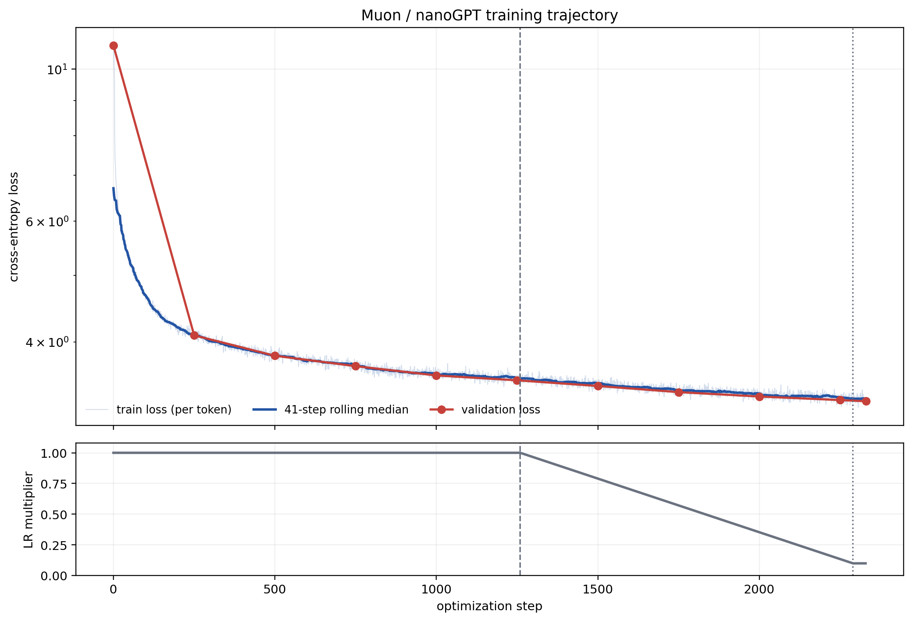
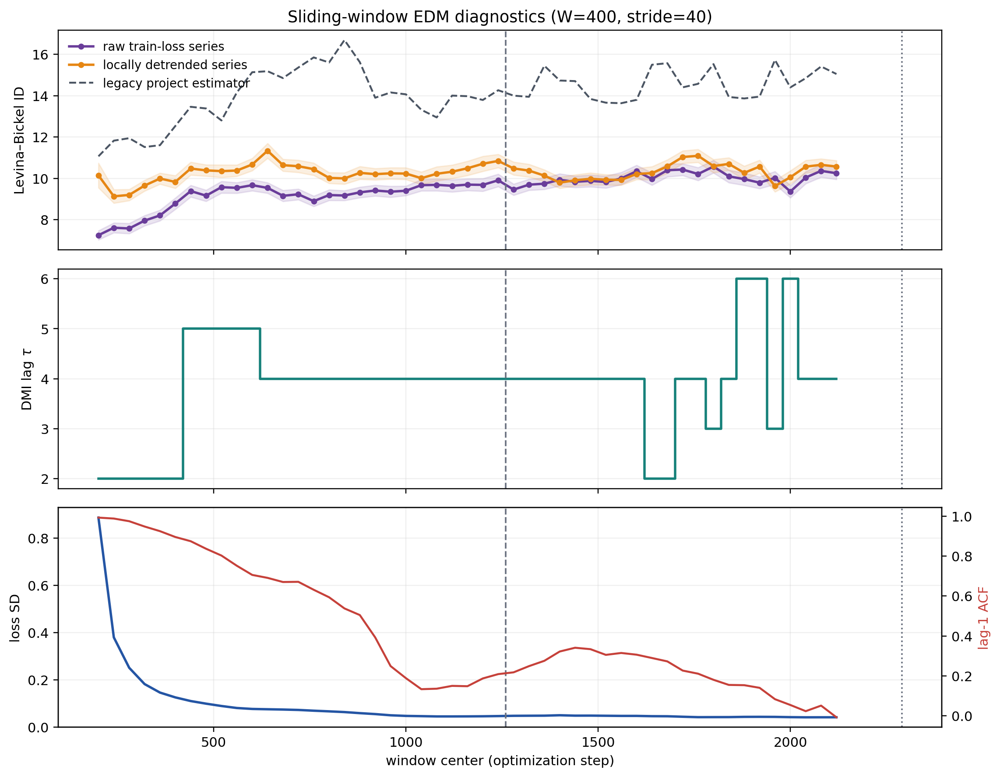
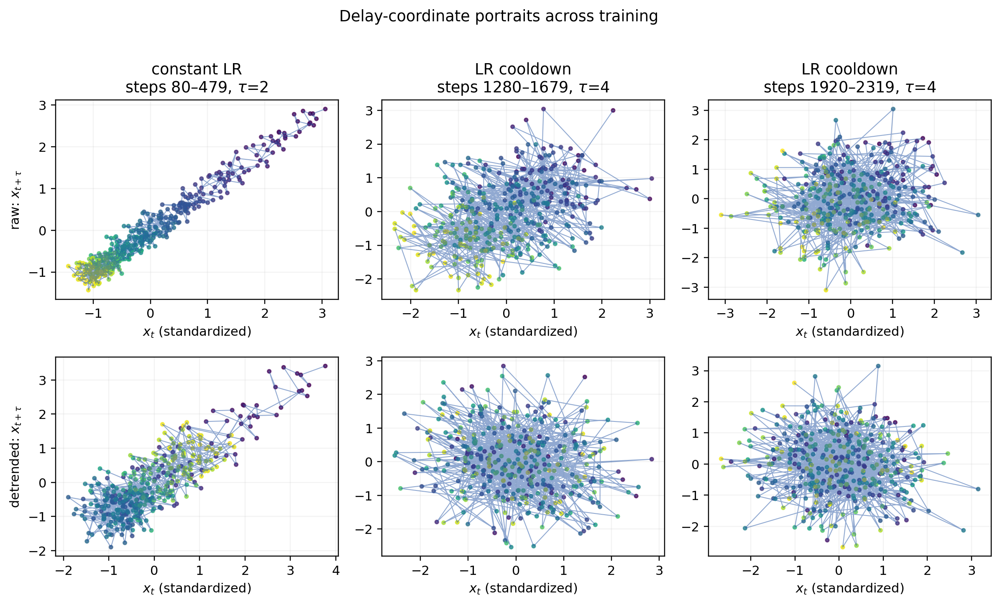
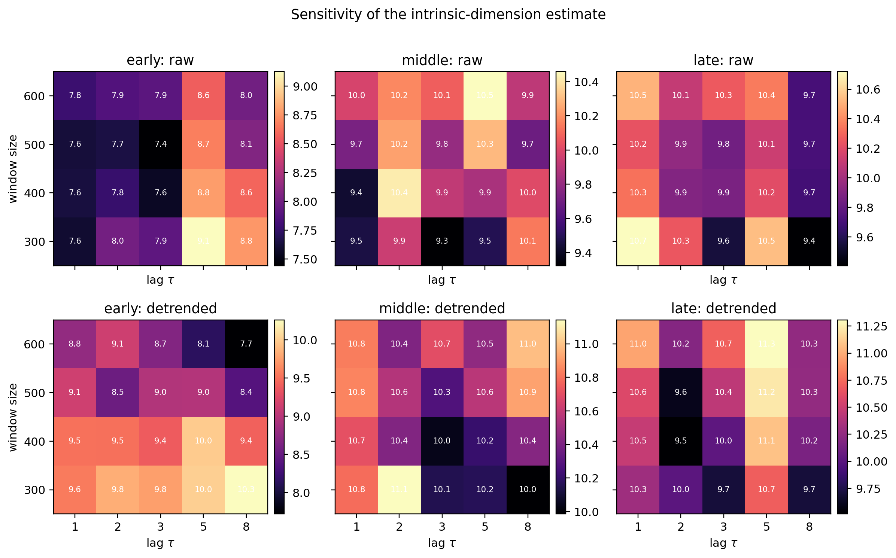
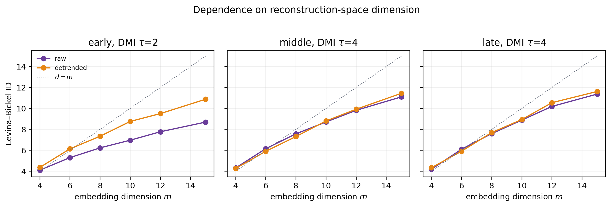

# EDM-анализ обучения Muon/nanoGPT на FineWeb10B

## Краткий вывод

Из файла `icomp_article/message (2).txt` восстановлен один полный запуск
`Muon_lr0.06_5db64adc`: 2330 последовательных значений training loss и 11
значений validation loss. Запуск завершился штатно, без дивергенции.

На этом запуске **не обнаружен коллапс эффективной размерности**, аналогичный
наблюдаемому в экспериментах с grokking. Напротив, оценка Levina–Bickel для
сырого ряда растёт приблизительно с 8.7 в ранних окнах до 10.1 в поздних.
После удаления локального линейного тренда изменение значительно слабее:
приблизительно с 10.1 до 10.5. Следовательно, низкая ранняя размерность сырого
loss в основном объясняется почти детерминированным быстрым спадом loss, а не
поздним сжатием аттрактора.

Для прямой сопоставимости также воспроизведён estimator из существующего
`code/Grokking/search_for_optimal_parameters.py` (`E=15`, `k=5`, `tau=1`, без
Theiler window). Он даёт более высокие абсолютные числа, около 12.9 в ранней и
14.8 в поздней части, но тот же качественный вывод: ID растёт, а не коллапсирует.

## Исходный эксперимент

- Модель: 12-слойный GPT, `model_dim=768`, 6 attention heads.
- Данные: FineWeb10B.
- Оптимизатор скрытых матриц: Muon, learning rate 0.06, momentum 0.95,
  weight decay 0.
- Прочие параметры оптимизируются DistAdam с learning rate 0.008.
- 8 GPU NVIDIA H100, глобальный batch 262144 токена.
- 2290 основных итераций и 40 дополнительных итераций.
- Linear cooldown learning rate начинается примерно с шага 1260.
- Итоговый validation loss: 3.2785; время обучения: 143.8 s.

Training loss в исходном файле является усреднённой между GPU **суммой**
token-level losses локального батча. Для анализа он был приведён к средней
cross-entropy делением на `262144 / 8 = 32768`. Значение изменилось с 10.8125
на первом шаге до 3.3008 на последнем. Validation loss снизился с 10.8258 до
3.2785.

## Методика EDM

Анализ выполнен на плотном training-loss ряде. Одиннадцати validation-точек
недостаточно для корректной фазовой реконструкции, поэтому они используются
только как независимый индикатор прогресса обучения.

Для каждого окна длиной 400 шагов со сдвигом 40 шагов:

1. задержка выбиралась как первый локальный минимум delayed mutual information;
2. строилось delay embedding размерности 12;
3. intrinsic dimension оценивалась методом Levina–Bickel по 10 соседям;
4. точки в пределах 12 временных шагов исключались из множества соседей
   (Theiler window);
5. расчёт повторялся после удаления локального линейного тренда.

Последний пункт критичен: нестационарный монотонный тренд сам формирует узкую
кривую в delay space и способен искусственно понизить оценку размерности.

## Наблюдения

В самом раннем окне с центром на шаге 200 оценка для сырого ряда равна 7.25,
тогда как после detrending она равна 10.14. В этом же окне lag-1
autocorrelation достигает 0.993: фазовый портрет определяется почти полностью
глобальным трендом обучения.

По мере стабилизации loss его стандартное отклонение внутри окна падает примерно
с 0.89 до 0.04, а lag-1 autocorrelation приближается к нулю. Сырой и detrended
ряды дают близкие оценки около 10 в основной части обучения. В момент начала LR
cooldown скачка или устойчивого падения ID нет.

Средние значения по окнам:

| Фаза schedule | Центры окон | DMI tau | ID raw | ID detrended | Legacy ID |
|---|---:|---:|---:|---:|---:|
| Constant LR | 200–1240 | 4 | 9.10 ± 0.73 | 10.25 ± 0.46 | 13.81 ± 1.46 |
| LR cooldown | 1280–2120 | 4 | 10.01 ± 0.31 | 10.33 ± 0.39 | 14.57 ± 0.72 |

Сорок шагов extension нельзя анализировать как отдельный режим при окне 400.

## Устойчивость вывода

Проверены окна 300, 400, 500 и 600 и задержки 1, 2, 3, 5 и 8. Поздняя оценка
не становится ниже ранней ни на устойчивом наборе параметров. Для detrended
loss оценки лежат примерно в диапазонах 7.7–10.3 (early), 10.0–11.1 (middle) и
9.5–11.3 (late).

Оценка также зависит от размерности реконструкционного пространства и при
`m=12` находится близко к верхней границе. Поэтому числа 10–10.5 не следует
интерпретировать как точную физическую размерность оптимизатора; надёжным здесь
является сравнительный вывод об отсутствии выраженного позднего коллапса.

## Интерпретация и ограничения

Этот запуск существенно отличается от экспериментов статьи с grokking:

- здесь нет plateau между memorization и delayed generalization и нет accuracy;
- наблюдается обычное непрерывное снижение train и validation loss;
- имеется явно заданный learning-rate schedule, нарушающий стационарность;
- доступен только один скалярный dense observable и один запуск;
- нет контрольных запусков с другими оптимизаторами или seed.

Поэтому эксперимент полезен как **negative/control case**: само успешное
обучение большой языковой модели не обязано сопровождаться dimensionality
collapse в скалярном loss. Он также показывает, почему для статьи необходимо
явно отделять геометрию локальных флуктуаций от глобального тренда.

Для сильного сравнительного эксперимента нужны остальные запуски оптимизаторов
из конфигурации (`MuonUSign`, `EF21-*`, `SignMuon`, `MuonSign`, `SignSGD`) и,
желательно, несколько seed. Тот же парсер обработает каждый файл при наличии
отдельных `RUNMETA`/`RUNEND` записей.
