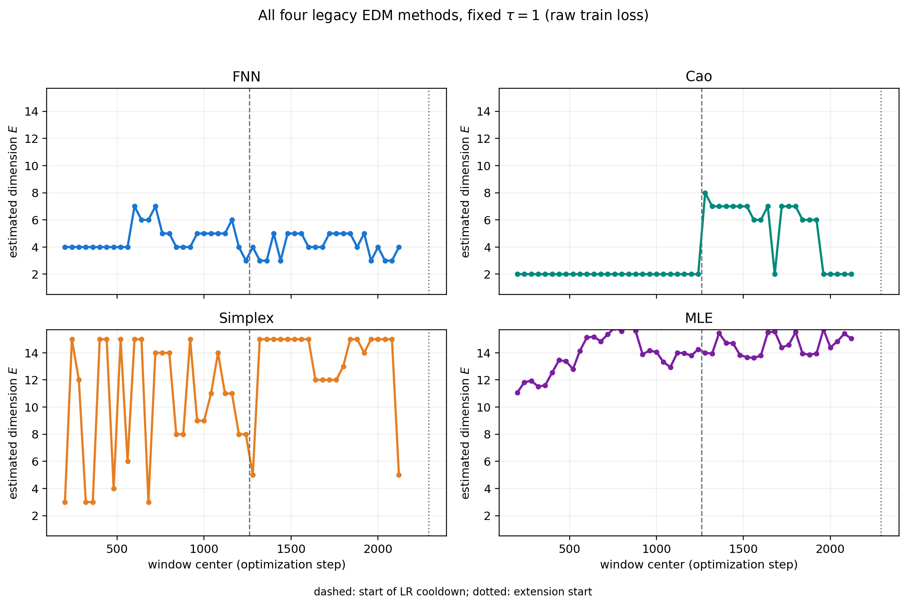
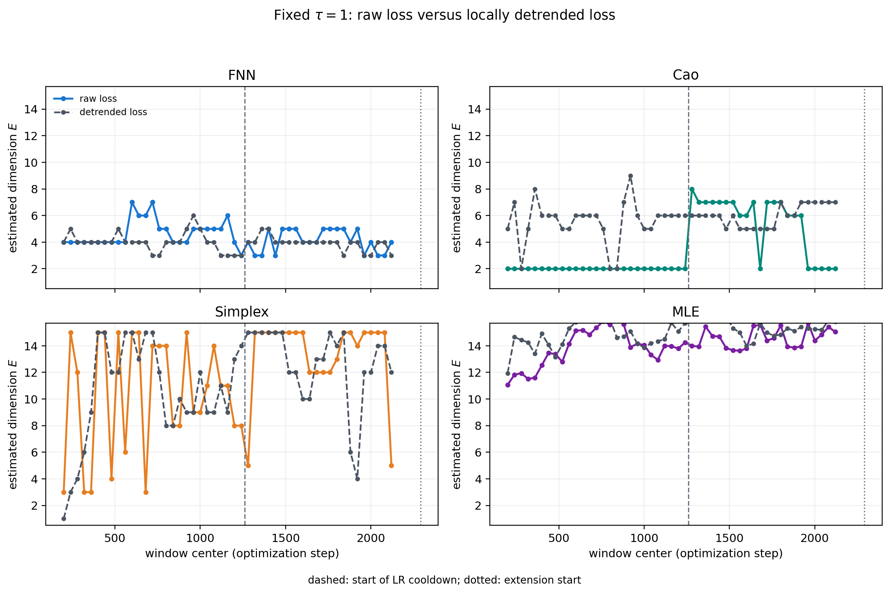
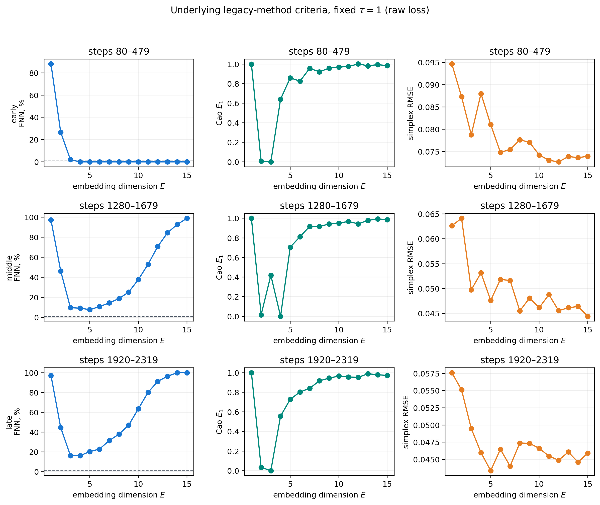

# EDM-анализ Muon/nanoGPT: фиксированная задержка tau = 1 и четыре метода

## Итог

Для ряда `train_loss` из `icomp_article/message (2).txt` выполнен повторный
скользящий анализ с фиксированной задержкой `tau=1`. Во всех 49 окнах длиной
400 шагов (stride 40) применены четыре метода из существующего проектного
модуля `code/Grokking/search_for_optimal_parameters.py`:

1. False Nearest Neighbors (FNN);
2. метод Cao;
3. simplex projection (выбор E по минимальному one-step RMSE);
4. Levina--Bickel maximum-likelihood intrinsic dimension (MLE ID).

Все четыре метода **не дают согласованного свидетельства позднего
dimensionality collapse**. FNN слабо уменьшается, однако Cao, simplex и MLE в
среднем увеличиваются либо остаются высокими. После detrending FNN остаётся
слабо нисходящим, а остальные три метода также не поддерживают коллапс.

## Данные и режим расчёта

Анализируется единственный завершённый запуск `Muon_lr0.06_5db64adc`:
2330 плотных значений training loss и 11 validation-loss точек. В исходном логе
training loss записан как усреднённая между GPU сумма loss локального батча; он
нормализован к token-level cross-entropy делением на 32768. Validation loss
используется только как внешний маркер прогресса: 11 точек недостаточно для EDM.

Во всех скользящих окнах использованы одни и те же настройки:

| Параметр | Значение |
|---|---:|
| Задержка tau | 1 |
| Длина окна | 400 шагов |
| Сдвиг окна | 40 шагов |
| Максимальная embedding dimension | 15 |
| MLE neighbours | 5 |
| FNN threshold | менее 1% false neighbours |
| Cao plateau rule | первый шаг с `abs(diff(E1)) < 0.05` |
| Simplex target | минимальный one-step out-of-sample RMSE |

Пунктирная вертикаль на графиках означает начало learning-rate cooldown
(примерно шаг 1260), точечная --- начало 40-шагового extension (2290).

## Результаты: ранние против поздних окон

«Ранние» и «поздние» значения ниже --- средние по первым и последним 12 окнам
соответственно. Изменение --- позднее минус раннее.

| Метод | Raw: early | Raw: late | Изменение | Detrended: early | Detrended: late | Изменение |
|---|---:|---:|---:|---:|---:|---:|
| FNN | 4.42 | 4.17 | -0.25 | 4.17 | 3.67 | -0.50 |
| Cao | 2.00 | 4.25 | +2.25 | 5.58 | 6.33 | +0.75 |
| Simplex | 10.08 | 13.17 | +3.08 | 10.00 | 12.00 | +2.00 |
| MLE ID | 12.88 | 14.77 | +1.89 | 14.39 | 15.30 | +0.91 |

FNN --- единственный метод со слабым снижением. Но его критерий является
пороговым: он выбирает первое `E`, где доля ложных соседей падает ниже 1%, и
изменяется лишь на целые значения. В поздней части его кривая не приходит к
стабильному нулю при малом E, а результаты меняются от окна к окну. Поэтому
этот сдвиг недостаточен для утверждения о топологическом коллапсе, особенно
когда три остальных метода показывают обратную или несогласованную динамику.

Метод Cao даёт постоянное `E=2` до cooldown и скачок к 6--8 после его начала;
последующее падение обратно к 2 на шагах около 1960--2120 показывает сильную
зависимость этого plateau-правила от конкретной формы временного ряда.
Simplex часто выбирает верхнюю границу `E=15`, то есть доступного диапазона
недостаточно, чтобы зафиксировать внутренний минимум prediction error. MLE ID
устойчиво находится в диапазоне примерно 11--16 и растёт к поздним окнам.

## Что именно оптимизируют методы

- FNN: процент ближайших соседей, ставших ложными при повышении E. Выбранное E
  -- первое ниже 1%.
- Cao: отношение `E1(E)` соседних расстояний; выбранное E -- первое место, где
  его соседняя разность меньше 0.05.
- Simplex: out-of-sample RMSE прогноза (x_{t+1}) по соседям в reconstructed
  state space; выбирается E с минимальным RMSE.
- MLE: средняя Levina--Bickel оценка локальной intrinsic dimension в embedding
  размерности 15. Поэтому она не обязана быть целой.

Абсолютные значения методов сравнивать между собой нельзя: они отвечают на
разные операциональные вопросы. Для эксперимента существенна согласованность
направления динамики, а её нет.

## Вывод для статьи

Это сильный negative/control case для формулировки статьи: непрерывное успешное
обучение LLM не демонстрирует универсального падения размерности только по
одномерному training loss. Если включать эксперимент в статью, корректная
формулировка:

> For this nanoGPT/Muon run, four fixed-lag dimension diagnostics do not show a
> consistent late-stage dimensionality collapse. The result highlights the
> dependence of scalar EDM estimates on the observable, estimator and
> non-stationary training schedule.

Для причинного или сравнительного вывода нужны другие optimizer runs и seeds из
того же benchmark. Текущий парсер можно применить к каждому такому логу.
