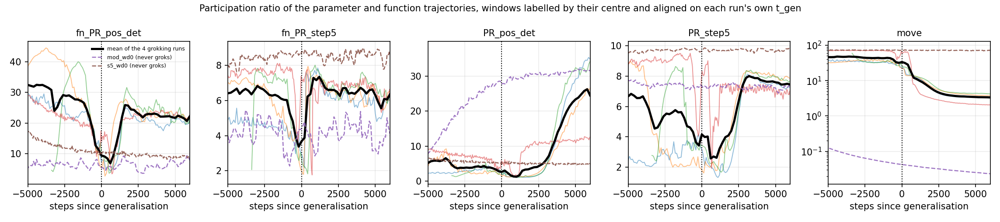

# A one-dimensional bottleneck at grokking

Measured directly, not through a delay embedding.

`../active_dimension/` established that the quantity behind "the number of actively
expressed degrees of freedom" is the **rank of the trajectory covariance** — a property of
a point cloud — and that the MG dimension of a 1-D log estimates something else: the
dimension of an invariant set, which for a converging or noise-driven trajectory is either
1 or undefined. It also established that the wanted quantity is cheap to measure from the
parameters. So this experiment measures it directly.

**Result.** At generalisation the trajectory collapses to **essentially one dimension** —
participation ratio 1.09–1.60 against a plateau value of 2.7–7.0 — and then re-expands.
The collapse happens in **function space first**, ~600–1000 steps before parameter space,
and both happen ~3 000 steps *before* the trajectory's total displacement collapses. It is
localised at `t_gen` in three seeds that grok at 3 680, 6 660 and 13 700, and in a second
task. The matched no-weight-decay controls, which never generalise, show no such feature.



## Setup

Six runs on Colab (T4, ~200 s each), reusing `../grokking_train/` unchanged — the configs
that produced the published logs:

| run | task | weight decay | t_mem | t_gen |
| --- | --- | --- | --- | --- |
| `mod_wd1` | modular addition p=113 | 1.0 | 30 | **13 700** |
| `mod_wd1_s43` | same, seed 43 | 1.0 | 30 | **6 660** |
| `mod_wd1_s44` | same, seed 44 | 1.0 | 30 | **3 680** |
| `s5_wd1` | S₅ composition | 0.2 | 25 | **6 735** |
| `mod_wd0` | modular addition p=113 | 0.0 | 40 | never |
| `s5_wd0` | S₅ composition | 0.0 | 20 | never |

The three `mod_wd1` seeds grok at 3 680, 6 660 and 13 700, which is what makes the
alignment test possible: a feature of *generalisation* survives averaging after alignment
on each run's own `t_gen`, while a feature of *training progress* smears out.

The full parameter vector is 226 816 doubles and there are 2 000–3 000 logged steps, so
every logged step is **sketched** — a CountSketch to R^1024, twice with independent hashes,
which preserves the Gram matrix and therefore the covariance spectrum to O(√(log T / D)) ≈
9 %. Two spaces are recorded: the parameters, and the centred and L2-normalised probe
logits (normalised because the raw logit scale is mechanically coupled to weight decay, so
a signal read off it could not be distinguished from a detector of weight decay).

`verify_noninvasive.py` requires the training log to be **bit-identical** with and without
the observer, and it passes — 40 rows × 6 columns over 400 steps. That check matters
because `grok/tasks.py` seeds one global torch RNG stream that the train/val split, the
weight initialisation and the mini-batch order all continue; a single stray draw changes
the initial weights and can destroy grokking.

## The measurement

Sliding windows of 60 logged rows (600 steps for the modular runs, 300 for S₅), labelled by
their **centre** so that the position of a feature is not an artefact of the labelling.
Per window, the participation ratio (Σλ)²/Σλ² of:

* `PR_pos_det` — the parameter positions, after removing a linear trend. A steady drift is
  rank 1 and would otherwise mask everything else.
* `PR_step5` — the parameter increments, block-averaged over 5 logged steps to suppress the
  mini-batch noise floor.
* `fn_PR_pos_det`, `fn_PR_step5` — the same on the normalised probe logits.
* `move` — total displacement in the window. The null: a participation ratio can fall
  simply because the trajectory stopped moving.

## What happens, per run

```
                        plateau      dip    at (steps      recovers    depth
                        median      value    from t_gen)     to
fn_PR_pos_det   mod_wd1  23.12       4.42       +595         20.38      5.2x
                    s43  33.06       2.71       +235         22.41     12.2x
                    s44  28.26       3.65       +515         23.35      7.7x
                 s5_wd1  21.15       3.41       +712         22.92      6.2x

fn_PR_step5     mod_wd1   4.50       2.16       +195          5.89      2.1x
                    s43   5.94       1.79       +135          6.26      3.3x
                    s44   7.12       1.82       +415          6.74      3.9x
                 s5_wd1   7.69       1.76       +712          6.80      4.4x

PR_pos_det      mod_wd1   3.09       1.09      +1095         25.16      2.8x
                    s43   2.70       1.15       +935         16.61      2.4x
                    s44   2.71       1.13      +1315         28.64      2.4x
                 s5_wd1   7.00       1.60       +862         11.61      4.4x

move            mod_wd1  33.22       3.41      +3895          3.40      9.7x
                    s43  36.09       4.17      +3835          4.04      8.7x
                    s44  33.74       4.45      +3915          4.38      7.6x
                 s5_wd1  70.33       2.28      +3962          2.19     30.8x
```

Three facts do the work.

**1. It is localised at generalisation.** The dip appears at +135 to +1315 steps from
`t_gen` in every run, in seeds whose `t_gen` differs by a factor of 3.7 and across two
tasks. Nothing that is merely a function of training progress can do that.

**2. It is not the trajectory slowing down.** Displacement collapses too — by 7.6× to 31× —
but it does so at +3 835 to +3 962, roughly **3 000 steps after** the rank collapse, in
every run without exception. And the rank collapse **recovers** while the displacement
never does: `PR_pos_det` returns to 11.6–28.6, well *above* its plateau value, while `move`
stays flat at its floor. A statistic that was reporting displacement would stay down.

**3. The controls do not do it.** In `mod_wd0` and `s5_wd0` the deepest dip anywhere in the
run is 1.17×–3.15× (with one 7.06× outlier), and every one of those minima sits in the
first few hundred steps — the initial transient — not at any mid-training event. The dashed
curves in the figure are flat or monotone through the region where the grokking runs dip.

## What it means, and what it does not

The trajectory passes through a **transient one-dimensional bottleneck** at generalisation:
for a few hundred steps the model moves along essentially a single direction in function
space, then in parameter space, and then re-expands into a *higher*-rank exploration than
it had during the plateau. That is a concrete, measured sense in which the system
"simplifies" at grokking — the one the original programme was looking for, found in the
covariance rank rather than in a delay-embedding dimension.

Three limits, stated plainly:

* **It is a signature, not a predictor.** The dip is at or just after `t_gen` (+135 to
  +1315 steps, against a window resolution of 300–600 steps). It cannot be used as the
  early-warning signal the earlier work wanted. Whether anything precedes it is a separate
  question this experiment does not answer.
* **Six runs, two tasks, one architecture.** The seed variation is the strongest part of
  the evidence; the task and architecture variation is thin.
* **The controls are not perfectly matched.** `wd0` differs from `wd1` in more than whether
  it generalises — its displacement collapses to ~0.03 while `wd1` stays at ~3.4, so the two
  families never occupy the same movement regime, and a movement-matched comparison is not
  possible on these runs. The timing argument (fact 2) carries the weight instead.

## Files

```
rank_probe.py            the observer: CountSketch of parameters and probe logits
run_rank.py              training driver, reuses grokking_train unchanged
verify_noninvasive.py    the bit-identical check
colab_rank.ps1           bundle, run on Colab, fetch                (see ../prediction_improved/README.md for setup)
analyze_rank.py          sliding-window participation ratios        -> results*/rank_windows.csv
phases.py                early / plateau / post split, and the movement confound
aligned.py               alignment on t_gen, right-edge windows
dip.py                   the dip: location, depth, recovery, controls, figure
```

`results/` uses 2 000-step windows, `results_fine/` 600-step windows; the numbers above are
the fine ones. `figures_fine/rank_dip.png` is the figure.
