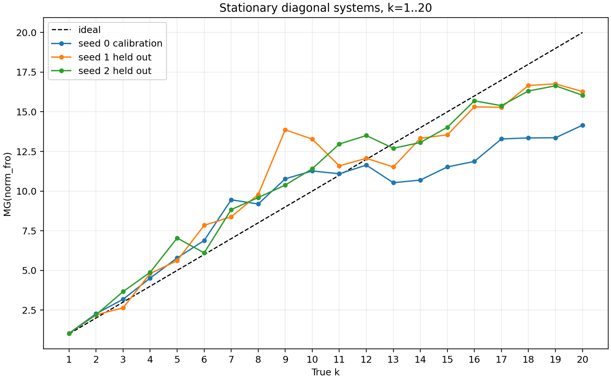
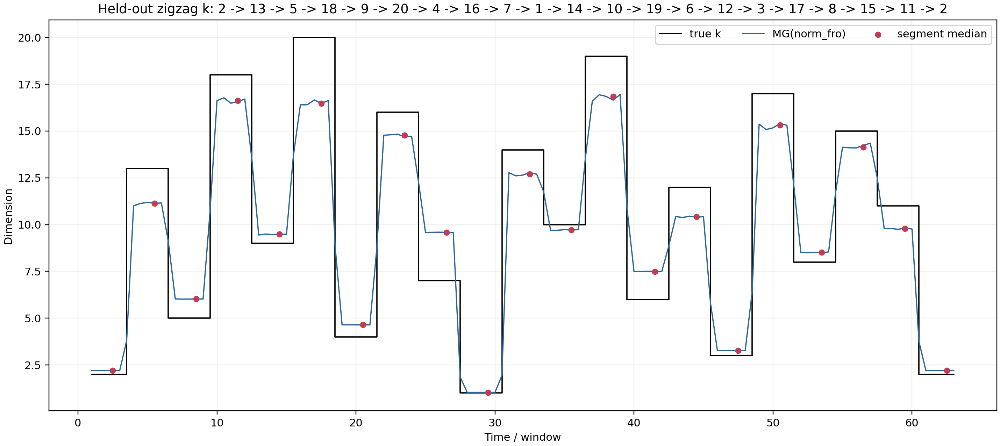

# Проверка восстановления размерности по Frobenius-наблюдателю

## Цель

Проверить, насколько оценка MacKay–Ghahramani (MG), вычисленная по временному ряду Frobenius-нормы, восстанавливает известное число активных компонент `k` в контролируемой системе.

## Эксперимент

- Система: диагональная матрица размерности `D=64`.
- Активны и колеблются только `k` диагональных компонент; остальные не меняются.
- Проверены `k=1,...,20`.
- Наблюдатель: Frobenius-норма диагональной матрицы.
- Оценка размерности: MG по временному ряду наблюдателя.
- Одна конфигурация параметров выбрана на seed 0 и затем без перенастройки проверена на других данных:

```text
window = 8000
cycles_per_window = 4000
max_E = 45
k_neighbors = 50
tau = 4
```

Дополнительно выполнен переходный тест со сменой `k` в следующей последовательности:

```text
2 -> 13 -> 5 -> 18 -> 9 -> 20 -> 4 -> 16 -> 7 -> 1 -> 14 -> 10 -> 19 -> 6 -> 12 -> 3 -> 17 -> 8 -> 15 -> 11 -> 2
```

## Результаты на стационарных системах

Калибровка на seed 0 дала MAE `2.151`, корреляцию Спирмена `0.956`.
На независимых seed:

| Seed | MAE | Максимальная ошибка | Spearman rho | Инверсии порядка |
|---:|---:|---:|---:|---:|
| 1 | 1.456 | 4.866 | 0.949 | 5 |
| 2 | 1.287 | 3.953 | 0.985 | 4 |

Средний held-out MAE: **1.372**.

Медианные оценки MG по двум held-out seed:

| Истинное `k` | MG | Ошибка |
|---:|---:|---:|
| 1 | 1.03 | +0.03 |
| 2 | 2.20 | +0.20 |
| 3 | 3.15 | +0.15 |
| 4 | 4.84 | +0.84 |
| 5 | 6.33 | +1.33 |
| 6 | 6.97 | +0.97 |
| 7 | 8.61 | +1.61 |
| 8 | 9.69 | +1.69 |
| 9 | 12.12 | +3.12 |
| 10 | 12.34 | +2.34 |
| 11 | 12.28 | +1.28 |
| 12 | 12.79 | +0.79 |
| 13 | 12.11 | -0.89 |
| 14 | 13.20 | -0.80 |
| 15 | 13.79 | -1.21 |
| 16 | 15.50 | -0.50 |
| 17 | 15.34 | -1.67 |
| 18 | 16.49 | -1.51 |
| 19 | 16.70 | -2.30 |
| 20 | 16.16 | -3.84 |



## Переходный тест

На zigzag-тесте оценка реагировала на смену числа активных компонент и в целом сохраняла порядок режимов.

- MAE по сегментам: **1.166**.
- Для `k=20` получено `MG=16.48`.
- Для `k=1` получено `MG=1.03`.



## Вывод

1. Frobenius-наблюдатель содержит информацию о числе активных компонент: MG хорошо сохраняет относительный порядок сложности (`rho` примерно `0.95-0.99`).
2. Для малых `k` (`1-4`) восстановление близко к абсолютному значению.
3. Начиная примерно с `k=9-12`, оценка становится смещённой, а при больших `k` насыщается около `16-17`.
4. Поэтому в текущей конфигурации MG по Frobenius-норме нельзя интерпретировать как точный абсолютный счётчик компонент вплоть до `k=20`.
5. Однако его можно использовать как устойчивый **относительный индикатор изменения эффективной размерности**. Для точного восстановления больших `k` нужно отдельно увеличивать информативность наблюдателя, длину данных и проверять влияние параметров EDM.

Все исходные таблицы, графики и конфигурация находятся в этой папке:

- `stationary_validation.csv`
- `zigzag_segments.csv`
- `calibration_grid.csv`
- `stationary_k1_k20.pdf`
- `zigzag_k20.pdf`