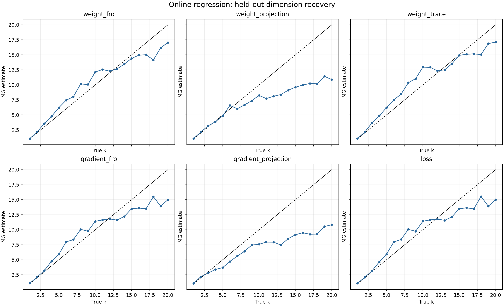

# Known-dimension online-regression experiment

A D=64 linear model was trained by full-batch gradient descent on one-hot inputs. Exactly k target coordinates changed quasiperiodically; all other targets were constant and already fitted. Therefore the active training dynamics had known dimension k. Values k=1,...,20 were tested.

A configuration was selected separately for each scalar observer on seed 0, but one common configuration was used for all k. Seeds 1 and 2 were held out. No per-k correction or output remapping was used.

## Held-out ranking

| observer | MAE | max error | mean rho | mean inversions |
|---|---:|---:|---:|---:|
| weight_fro | 1.337 | 4.631 | 0.980 | 3.5 |
| weight_trace | 1.378 | 3.739 | 0.983 | 4.0 |
| gradient_fro | 1.728 | 5.423 | 0.960 | 5.5 |
| loss | 1.733 | 5.420 | 0.960 | 5.5 |
| weight_projection | 3.482 | 9.894 | 0.980 | 5.0 |
| gradient_projection | 3.836 | 9.835 | 0.965 | 4.5 |

Best observer by held-out MAE: **weight_fro**.

| true k | held-out median MG | error |
|---:|---:|---:|
| 1 | 1.057 | +0.057 |
| 2 | 2.157 | +0.157 |
| 3 | 3.552 | +0.552 |
| 4 | 4.757 | +0.757 |
| 5 | 6.210 | +1.210 |
| 6 | 7.442 | +1.442 |
| 7 | 8.037 | +1.037 |
| 8 | 10.155 | +2.155 |
| 9 | 10.067 | +1.067 |
| 10 | 12.133 | +2.133 |
| 11 | 12.569 | +1.569 |
| 12 | 12.279 | +0.279 |
| 13 | 12.661 | -0.339 |
| 14 | 13.450 | -0.550 |
| 15 | 14.411 | -0.589 |
| 16 | 14.944 | -1.056 |
| 17 | 15.023 | -1.977 |
| 18 | 14.147 | -3.853 |
| 19 | 16.169 | -2.831 |
| 20 | 17.056 | -2.944 |

Runtime: 141.8 seconds.