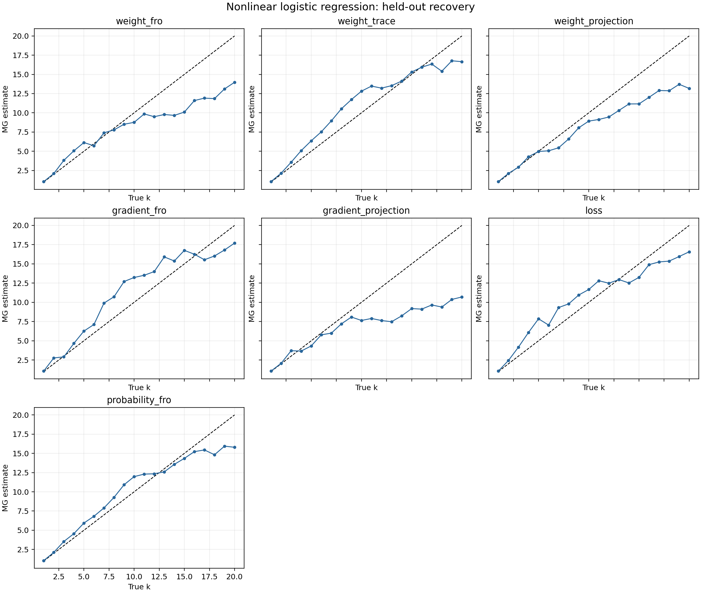

# Нелинейная логистическая регрессия с известной размерностью

## Постановка

Логистическая модель размерности `D=64` обучалась полным градиентным спуском с binary cross-entropy на one-hot входах. Ровно `k` целевых логитов менялись квазипериодически и независимо; остальные были постоянны. Поэтому истинная размерность активной динамики равна `k`.

Проверены `k=1,...,20`, семь одномерных наблюдателей и четыре набора параметров MG. Параметры выбирались на seed 0 сразу для всех `k`; seeds 1 и 2 оставались тестовыми. Коррекция отдельно для каждого `k` не применялась.

## Результаты

| Наблюдатель | MAE | Макс. ошибка | Spearman rho | Инверсии |
|---|---:|---:|---:|---:|
| `probability_fro` | 1.326 | 5.831 | 0.986 | 2.5 |
| `weight_trace` | 1.422 | 3.919 | 0.986 | 2.0 |
| `gradient_fro` | 1.778 | 3.866 | 0.960 | 5.0 |
| `loss` | 1.889 | 4.961 | 0.966 | 3.5 |
| `weight_projection` | 2.367 | 6.954 | 0.986 | 3.5 |
| `weight_fro` | 2.478 | 8.088 | 0.965 | 3.0 |
| `gradient_projection` | 3.628 | 10.233 | 0.945 | 5.5 |

Лучший наблюдатель: **`probability_fro`**.

| Истинное k | Медиана MG | Ошибка |
|---:|---:|---:|
| 1 | 1.057 | +0.057 |
| 2 | 2.125 | +0.125 |
| 3 | 3.539 | +0.539 |
| 4 | 4.556 | +0.556 |
| 5 | 5.935 | +0.935 |
| 6 | 6.822 | +0.822 |
| 7 | 7.907 | +0.907 |
| 8 | 9.284 | +1.284 |
| 9 | 10.921 | +1.921 |
| 10 | 11.976 | +1.976 |
| 11 | 12.303 | +1.303 |
| 12 | 12.343 | +0.343 |
| 13 | 12.593 | -0.407 |
| 14 | 13.570 | -0.430 |
| 15 | 14.350 | -0.650 |
| 16 | 15.227 | -0.773 |
| 17 | 15.447 | -1.553 |
| 18 | 14.819 | -3.181 |
| 19 | 15.939 | -3.061 |
| 20 | 15.791 | -4.209 |

## Вывод

MG по одномерным логам сохраняет информацию о числе активных степеней свободы и в нелинейной задаче с BCE. Абсолютную точность и насыщение при больших `k` следует оценивать по таблице, а не скрывать калибровкой.

Время расчёта: 98.4 с.