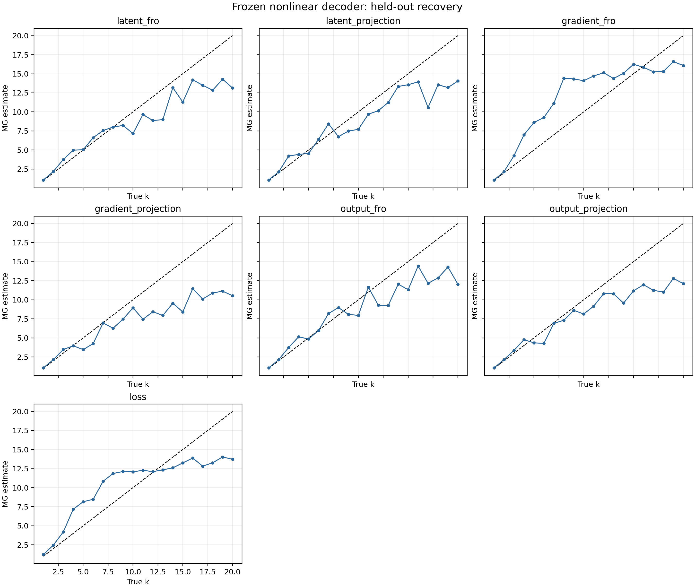

# Замороженный нелинейный декодер с известной размерностью

## Постановка

Обучаемый вектор `z` размерности `k` оптимизировался через замороженный нелинейный MLP-декодер `F(z)`. Целью служил `F(z*(t))`, где все `k` координат `z*` менялись независимо. Градиент вычислялся точным backpropagation через tanh-слой.

Линейный skip в декодере сохранял полный ранг отображения, поэтому доступное пространство оптимизации и истинная динамическая размерность равны `k`. Проверены `k=1,...,20`, семь одномерных логов и четыре конфигурации MG.

Конфигурации выбирались на seed 0 сразу для всех `k`; seeds 1 и 2 были отложены для теста. Подгонка отдельно под каждое `k` не применялась.

## Результаты

| Наблюдатель | MAE | Макс. ошибка | Spearman rho | Инверсии |
|---|---:|---:|---:|---:|
| `latent_projection` | 2.131 | 7.791 | 0.924 | 6.5 |
| `output_fro` | 2.247 | 8.378 | 0.941 | 6.0 |
| `latent_fro` | 2.260 | 6.943 | 0.935 | 7.0 |
| `loss` | 2.553 | 6.424 | 0.956 | 4.0 |
| `gradient_fro` | 2.643 | 7.337 | 0.911 | 5.0 |
| `output_projection` | 2.726 | 8.666 | 0.935 | 6.5 |
| `gradient_projection` | 3.430 | 11.314 | 0.908 | 6.5 |

Лучший наблюдатель: **`latent_projection`**.

| Истинное k | Медиана MG | Ошибка |
|---:|---:|---:|
| 1 | 1.064 | +0.064 |
| 2 | 2.130 | +0.130 |
| 3 | 4.214 | +1.214 |
| 4 | 4.415 | +0.415 |
| 5 | 4.544 | -0.456 |
| 6 | 6.398 | +0.398 |
| 7 | 8.434 | +1.434 |
| 8 | 6.745 | -1.255 |
| 9 | 7.482 | -1.518 |
| 10 | 7.707 | -2.293 |
| 11 | 9.691 | -1.309 |
| 12 | 10.152 | -1.848 |
| 13 | 11.232 | -1.768 |
| 14 | 13.332 | -0.668 |
| 15 | 13.561 | -1.439 |
| 16 | 13.938 | -2.062 |
| 17 | 10.565 | -6.435 |
| 18 | 13.553 | -4.447 |
| 19 | 13.192 | -5.808 |
| 20 | 14.049 | -5.951 |

## Вывод

Эксперимент проверяет восстановление известной размерности после нелинейного смешивания и backpropagation. Итоговую точность следует оценивать по held-out результатам выше.

Время расчёта: 196.7 с.