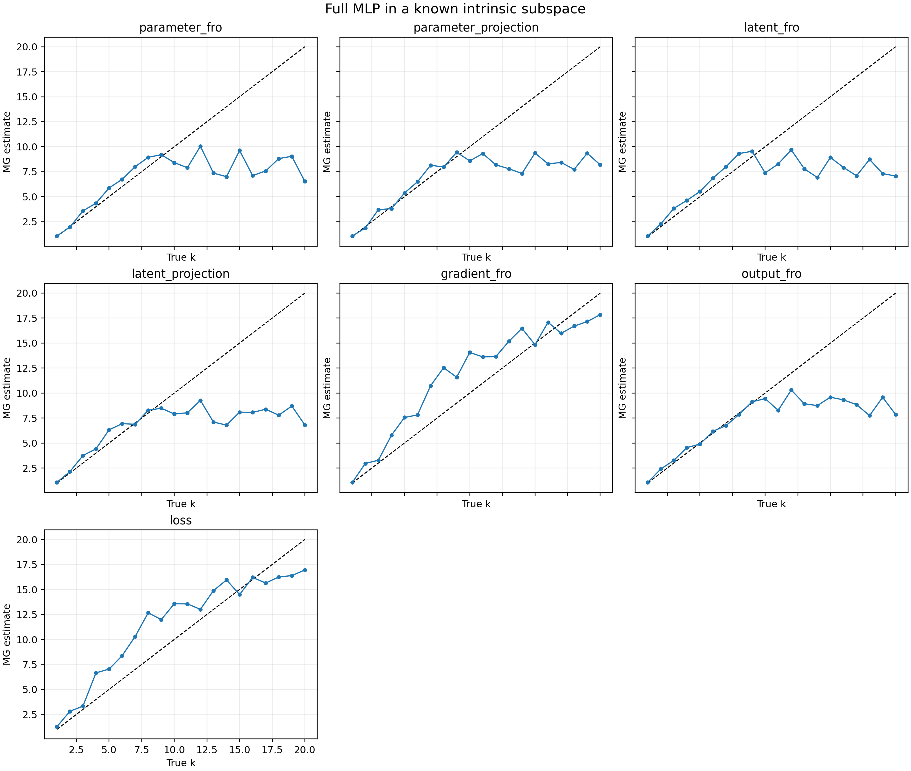

# MLP в известном k-мерном подпространстве параметров

## Постановка

Использовалась двухслойная MLP с `P=243` параметрами и фиксированным набором из `40` входов. Полный вектор параметров задавался как `theta=theta0+Uz`, где столбцы `U` ортонормированы, а обучался только `z` размерности `k`.

Цели генерировались той же MLP при независимо меняющихся координатах `z*(t)`. Градиент проходил через оба слоя MLP, после чего проецировался как `U.T grad_theta`. Следовательно, модель имеет сотни параметров, но ровно `k` доступных направлений оптимизации.

Проверены `k=1,...,20`. Численный ранг отображения из `z` в предсказания совпал с `k` во всех held-out запусках: **True**.

Параметры MG выбирались на seed 0 сразу для всех `k`; seeds 1 и 2 были отложены. Подгонка результата отдельно под каждое `k` не применялась.

## Результаты

| Наблюдатель | MAE | Макс. ошибка | Spearman rho | Инверсии |
|---|---:|---:|---:|---:|
| `gradient_fro` | 2.057 | 5.863 | 0.939 | 6.5 |
| `loss` | 2.106 | 5.045 | 0.939 | 6.0 |
| `output_fro` | 3.497 | 13.190 | 0.708 | 7.0 |
| `parameter_projection` | 3.857 | 13.401 | 0.641 | 7.5 |
| `parameter_fro` | 4.068 | 14.343 | 0.549 | 6.0 |
| `latent_projection` | 4.206 | 13.645 | 0.605 | 8.0 |
| `latent_fro` | 4.247 | 13.759 | 0.511 | 8.5 |

Лучший наблюдатель: **`gradient_fro`**.

| Истинное k | Медиана MG | Ошибка |
|---:|---:|---:|
| 1 | 1.056 | +0.056 |
| 2 | 2.958 | +0.958 |
| 3 | 3.279 | +0.279 |
| 4 | 5.771 | +1.771 |
| 5 | 7.556 | +2.556 |
| 6 | 7.813 | +1.813 |
| 7 | 10.731 | +3.731 |
| 8 | 12.534 | +4.534 |
| 9 | 11.586 | +2.586 |
| 10 | 14.059 | +4.059 |
| 11 | 13.621 | +2.621 |
| 12 | 13.648 | +1.648 |
| 13 | 15.180 | +2.180 |
| 14 | 16.471 | +2.471 |
| 15 | 14.834 | -0.166 |
| 16 | 17.082 | +1.082 |
| 17 | 15.973 | -1.027 |
| 18 | 16.702 | -1.298 |
| 19 | 17.148 | -1.852 |
| 20 | 17.846 | -2.154 |

## Вывод

Это наиболее близкий к обычному обучению контроль: нелинейная MLP, фиксированные входы, MSE и полный backpropagation, но известное число доступных направлений параметров. Точность восстановления приведена без коррекции по истинному `k`.

Время: 116.0 с.