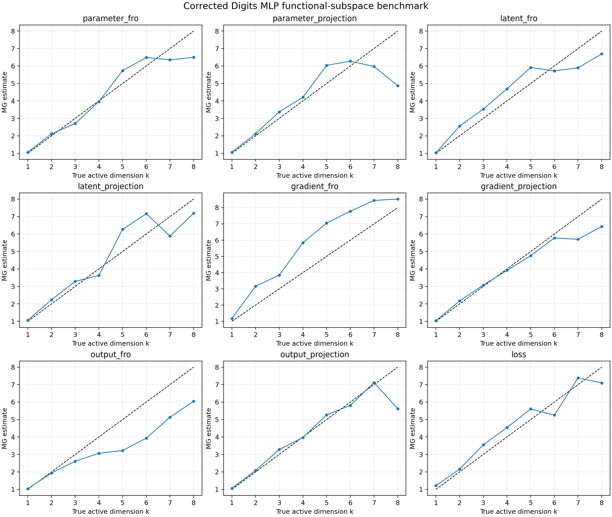

# Corrected real-Digits dimension-recovery experiment

## Setup

A nonlinear 64-16-10 tanh MLP was trained on the real sklearn Digits labels. A local adapter was then constructed around the trained network. Its function-space Jacobian was QR-whitened, so its first k columns have rank k and equal local scale. A quasiperiodically moving teacher excites every adapter coordinate; the student tracks it using exact backpropagation through both MLP layers.

The sweep uses k=1,...,8, fixed projections, matched spectral bandwidth, E>2k, and a Theiler exclusion equal to the delay-vector span. Hyperparameters were selected on seed 0 and frozen for held-out seeds 1 and 2.

## Ground-truth checks

All functional, trajectory-covariance and update-covariance ranks equal k: **True**.

## Held-out results

| Observer | MAE | Max error | Spearman rho | Mean inversions |
|---|---:|---:|---:|---:|
| `gradient_projection` | 0.504 | 1.954 | 0.988 | 0.5 |
| `loss` | 0.514 | 1.015 | 0.952 | 2.0 |
| `parameter_fro` | 0.613 | 1.794 | 0.964 | 0.5 |
| `output_projection` | 0.647 | 2.662 | 0.952 | 1.0 |
| `latent_projection` | 0.664 | 1.929 | 0.893 | 1.0 |
| `latent_fro` | 0.677 | 1.768 | 0.940 | 1.5 |
| `parameter_projection` | 0.874 | 3.889 | 0.833 | 2.0 |
| `output_fro` | 1.135 | 2.346 | 1.000 | 0.0 |
| `gradient_fro` | 1.228 | 2.619 | 0.988 | 0.5 |

Best observer: **`gradient_projection`**.

| True k | Median held-out MG | Error |
|---:|---:|---:|
| 1 | 1.032 | +0.032 |
| 2 | 2.172 | +0.172 |
| 3 | 3.072 | +0.072 |
| 4 | 3.919 | -0.081 |
| 5 | 4.758 | -0.242 |
| 6 | 5.777 | -0.223 |
| 7 | 5.697 | -1.303 |
| 8 | 6.438 | -1.562 |

## Interpretation

This experiment tests recovery of an explicitly verified active dynamical dimension on real inputs and in a nonlinear trained network. It does not claim that every scalar observer is generic or that available parameter count alone equals dynamic dimension.

Runtime: 113.9 s.