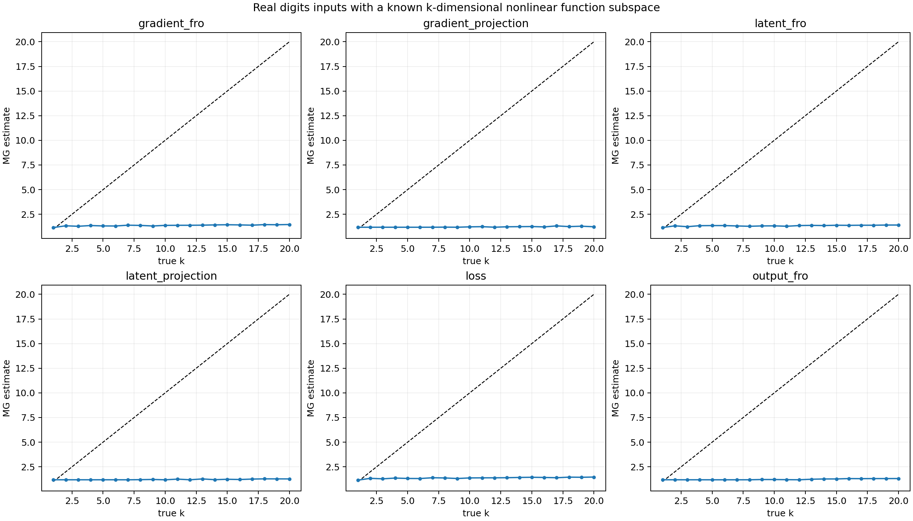

# Real-digits functional-subspace benchmark (v2)

The input data are real sklearn digits. A frozen tanh feature map and QR-orthogonalized logit functions define a known k-dimensional function subspace. The teacher coefficients have independent incommensurate temporal drives, and the student tracks them by gradient descent. This explicitly excites all k directions; the earlier fixed-target version produced a rank-one exponential transient. Random projections are fixed for the entire run.

| observer | MAE | max error | Spearman rho |
|---|---:|---:|---:|
| gradient_fro | 9.154 | 18.583 | 0.715 |
| gradient_projection | 9.297 | 18.768 | 0.666 |
| latent_fro | 9.172 | 18.599 | 0.686 |
| latent_projection | 9.303 | 18.772 | 0.676 |
| loss | 9.153 | 18.583 | 0.714 |
| output_fro | 9.292 | 18.794 | 0.796 |

The known k is the rank of the probe-set Jacobian by construction. This validates recoverability of a controlled functional dimension, not the claim that every scalar norm is informative.

Runtime: 684.7 s.