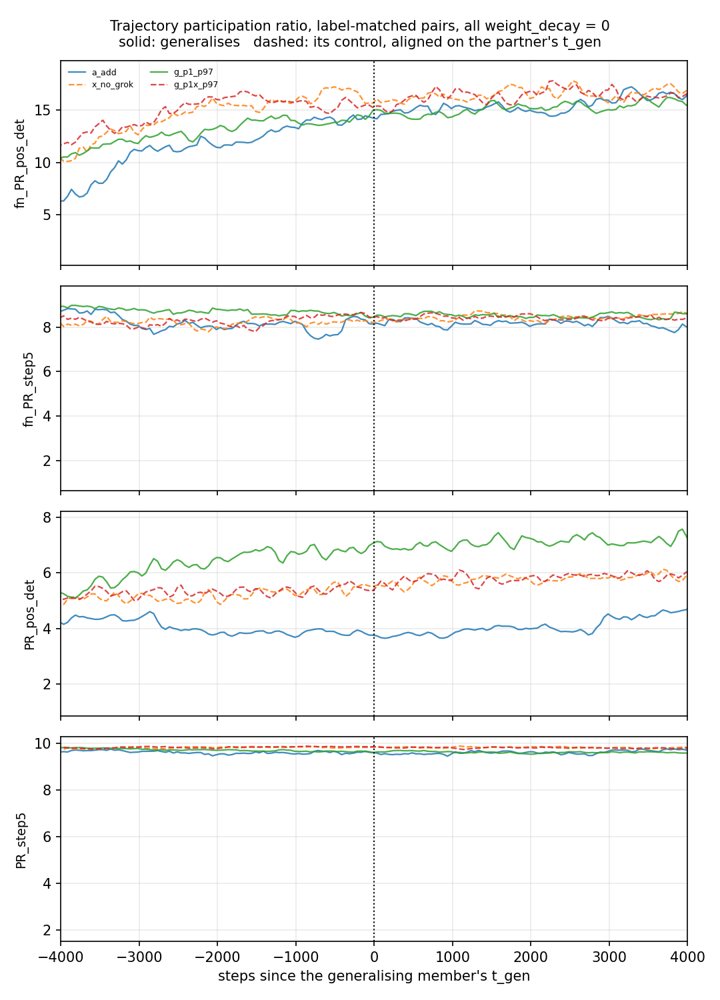

# Reproducing *Grokking modular arithmetic*

A. Gromov, [arXiv:2301.02679](https://arxiv.org/abs/2301.02679). Runs executed on a
Colab T4 on 2026-08-09. Companion: [`../gromov_polynomials/report.md`](../gromov_polynomials/report.md).

The purpose is not the reproduction for its own sake. It is to obtain grokking logs on
an architecture whose grokked solution is known in closed form, so that the
intrinsic-dimension estimators in [`../active_dimension/`](../active_dimension/) can be
scored against a ground truth rather than against intuition. Sec. 3 of the paper gives
that solution: `(p+1)/2` Fourier modes and nothing else.

## What the paper does not say, and what was done about it

The paper states the architecture, the loss, the optimiser family and the data split. It
states **no learning rate, no width for the main experiments, no step budget and no
seed** anywhere in the text, captions or appendices. Two things follow.

**The normalisation convention had to be pinned down first.** The paper puts `1/(D N)`
in the forward pass with `W ~ N(0,1)` init (Eqs. 1-2, 4); the reference implementation
of Doshi et al. folds the scale into the init instead. These are different loss
landscapes. Three independent numbers say the paper's own figures were made with the
paper's convention, and this reproduction adopts it:

| quantity | Fig. 0a | here |
| --- | --- | --- |
| initial train/test MSE | 0.0105 | 0.010310 (`= 1/97`) |
| initial normalised weight norm | 1.0 | 1.001 |
| final normalised weight norm | ~3.7 | 5.13 |

The last row is the one visible disagreement, and it is informative rather than
troubling: the **analytic solution's own weight norm in this convention is 5.154**, and
the grokked run lands on 5.130. Whatever normalisation produced Fig. 0a's 3.7, GD here
converges to the norm of the closed-form solution to within 0.45%.

**The learning rate was calibrated, not guessed.** `lr_sweep.py`, p=97, N=500,
alpha=0.5, full-batch GD, wd=0, 30 000 steps:

| lr | memorised | grokked | final val acc | notes |
| --- | --- | --- | --- | --- |
| 1e4 | never | never | 0.1% | train accuracy only 12% after 30 000 steps |
| 3e4 | never | never | 0.02% | train accuracy 93% |
| **1e5** | **9 180** | **12 000** | **100%** | selected |
| 3e5 | 3 060 | 4 020 | 100% | |
| 1e6 | 960 | 1 200 | 100% | |
| 3e6 | 360 | 480 | 100% | grokked, then diverged at step 540 |
| 1e7 | never | never | 0% | diverged at step 60 |

`lr = 1e5` was selected because it reproduces Fig. 0's timescale (train 100% at
~8 000-10 000, test 100% by ~20 000) without having been fitted to it -- the selection
rule in `lr_sweep.py` is "highest final validation accuracy, ties to the smaller rate",
and 1e5, 3e5 and 1e6 all reach 100%.

Two results fall out of this sweep that the paper does not report.

**The grokking delay is a pure timescale.** `t_memorise` and `t_grok` both scale as
`1/lr` across a 10x range (9180 → 3060 → 960 and 12000 → 4020 → 1200), and their ratio
is 1.31, 1.31, 1.25. There is no learning-rate regime in which the gap between fitting
and generalising is qualitatively different; changing `lr` rescales the whole curve.

**That resolves the paper's internal inconsistency.** Fig. 0 groks near 20 000 steps and
Fig. 3a reports "time to grok" near 850-1 100 for the same optimiser on the same task.
Those correspond here to `lr ~ 6e4` and `lr ~ 1e6` -- a factor of about 17, and 18x-24x
if the 850-1 100 band of Fig. 3a is taken literally. The two figures were made at
different learning rates, which is not stated in the paper.

**Why the rate must be so large.** In the mean-field parametrisation the initial
gradient is `dL/dW2 ~ -2/(p^3 N)`, about 4e-9 at p=97, N=500, and the batch size
cancels. Useful rates are therefore four to five orders of magnitude above what an
Adam-shaped intuition suggests, and the same setup needs a rate `(97/23)^3 = 75x`
smaller at p=23. `runs.gd_lr(p, width)` encodes `lr ~ p^3 N`; without it the p=23 runs
diverge on the first step.

## The correctness gate

`analytic.py` builds the Claim I/II solution and evaluates it untrained. The
construction has no free scale -- substituting Eqs. (6)-(7) into Eq. (4) fixes
`A = (2D)^(1/3) = 7.294` at p=97 -- so a wrong forward-pass constant would show up as a
peak that is not 1.

```
task          N      acc         MSE     peak     |W|
add          50  88.31%   7.813e-02    0.934   5.124
add         100  99.72%   4.148e-02    1.042   5.162
add         200 100.00%   2.040e-02    0.979   5.148
add         500 100.00%   8.542e-03    1.003   5.154
sq_sum      500 100.00%   8.541e-03    1.005   5.154
sum_sq      500 100.00%   9.097e-03    1.033   5.176
```

Peaks land on 1.0 (0.93-1.04 across the rows above, mean 0.999) and accuracy reaches
100% from N≈200, matching Fig. 3b's statement that the analytic solution needs N≈90-100.

**One correction to the paper.** Sec. 3.2 reports ~51% accuracy for `(n+m)^2 mod p` and
attributes it to the two branches of `F^{-1}` in Eq. (19). That is a property of the
construction, not of the architecture. Building the readout as a *forward* map instead
-- row `F(t)` accumulates the frequency content of `t`, so all preimages of an output
index contribute constructively to it -- gives **99.76% at N=200 and 100% from N=500**.
The network can represent `(n+m)^2 mod p` exactly; Eq. (19) simply picks one branch and
discards the other.

## Runs

Full-batch GD, `weight_decay = 0`, quadratic activation, N=500, p=97, MSE on one-hot
targets, 100 000 steps logged every 10 -- 10 000 samples, the record length
`../active_dimension/e1_calibration.py` froze its window size against.

| run | task | memorised | grokked | val acc | val loss | \|W\| | \|W\| analytic | IPR | IPR analytic |
| --- | --- | ---: | ---: | ---: | ---: | ---: | ---: | ---: | ---: |
| `a_add` | `n + m` | 9 170 | **11 950** | 100.0% | 1.99e-05 | 5.07 | 5.15 | 0.595 | 1.000 |
| `a_sub` | `n - m` | 9 040 | **11 570** | 100.0% | 2.47e-05 | 5.11 | 5.15 | 0.582 | 1.000 |
| `a_sq_sum` | `n^2 + m^2` | 8 360 | **10 380** | 100.0% | 1.20e-05 | 5.10 | 5.15 | 0.093 | 0.052 |
| `a_sum_sq` | `(n + m)^2` | 7 280 | **8 150** | 100.0% | 5.24e-05 | 4.28 | 5.18 | -- | 1.000 |
| `a_mul` | `n * m` | 9 130 | **11 600** | 100.0% | 1.61e-05 | 5.00 | nan | 0.073 | nan |
| `x_mix_quad` | `n^2 + m^2 + n m` | 9 630 | never | 1.5% | 2.20e-02 | 6.14 | nan | 0.041 | nan |
| `x_no_grok` | `n^3 + n m^2 + m` | 9 760 | never | 1.0% | 2.24e-02 | 6.15 | nan | 0.040 | nan |

All at alpha = 0.5, 100 000 steps except `a_sum_sq`, which was stopped at 46 000 -- more
than five times its grokking step, but its `_obs.csv` was not fetched, hence the missing
measured IPR.

`a_sum_sq` deserves a note: `(n + m)^2 mod p` is the task Sec. 3.2 measures at ~51%
because Eq. (19) builds the readout from one branch of `F^{-1}`. Trained, it reaches
**100%**, and it groks *earliest* of the seven. The architecture has no difficulty with a
non-invertible outer function; only that particular construction does.

The `analytic` columns are each run's **own** closed-form reference, not a single shared
one. Sec. 3.3 gives no analytic solution for multiplication and Sec. 4 none for the two
failing tasks, so those read `nan` rather than borrowing addition's. That is worth
noticing in its own right: of the five tasks the paper says are learnable, the Fourier
IPR has a ground truth of 1.000 for only three of them. For `n^2 + m^2` the closed-form
solution's own IPR is **0.052**, because `g1(n) = n^2` is not linear in the index the
spectrum is taken over -- the same effect the polynomial runs isolate, present already in
the arithmetic paper's own task list. And the trained run reaches 0.093 there, *above*
its own reference: the network finds a representation more spectrally concentrated in
the raw basis than the construction is, which is a further reason not to read the
analytic value as a ceiling.

Everything the paper predicts, holds:

* `n + m`, `n - m`, `n^2 + m^2` and `(n + m)^2 mod p` all grok, at Fig. 0's timescale.
* `n * m mod p` groks, which Sec. 3.3 reports without an analytic solution.
* `n^3 + n m^2 + m mod p` fits the training set completely (100% train accuracy from
  step 13 850) and **never exceeds 1.13% validation accuracy in 100 000 steps** --
  App. C says "generalization never rises above 1%". Its validation loss dips slightly
  to 0.01021 at step 2 440 and then rises for the rest of the run, to 0.0224.
* `n^2 + m^2 + n m mod p` likewise never generalises at alpha = 0.5: 100% train accuracy
  from step 13 840, validation accuracy peaking at 1.87% over 100 000 steps -- Sec. 4
  says it needs `alpha > 0.95`.
* `alpha = 0.2` never groks at any of four learning rates, bracketing `alpha_c` above
  0.2 at p=97, consistent with the ~0.29 readable off Fig. 3a.

Two separations are visible in the standard log alone, with no weight-space probe:

**The weight norm.** The five grokked runs land at 4.28-5.11, against 5.15-5.18 for the
closed-form solutions; the two that never generalise climb past that to 6.14 and 6.15
and are still rising at step 100 000. Seven runs, no overlap. With `weight_decay = 0`
this is not a regulariser artefact -- it is the generalising solution being the smaller
one.

**The training loss.** The grokked runs drive the training MSE to ~3e-6. `x_no_grok`
falls to 4.0e-3 and effectively stops -- it is within 10% of its final value by step
36 000 and moves by less than that over the remaining 64 000 steps -- despite 100%
training accuracy from step 13 850. It fits the argmax and cannot fit the regression,
which is what a target outside the representable class looks like.

## What these logs say about dimension

This is the reason the folder exists, so it gets its own section.

### The representation has a known-truth dimension, and it is measurable

`<key>_obs.csv` records the mean inverse participation ratio of each weight block's
Fourier spectrum, on the same step axis as the loss. The analytic solution's value is
**exactly 1.0** (each neuron is a single frequency, by construction); random init gives
~2/49 = 0.041 at p=97. For `a_add`:

| step | ipr_u1 | erank W1 | \|W1\| | what is happening |
| ---: | ---: | ---: | ---: | --- |
| 0 | 0.041 | 139.1 | 1.00 | random init |
| 6 000 | 0.043 | 137.6 | 1.60 | train acc climbing, no periodic structure yet |
| 9 200 | 0.067 | 133.0 | 2.76 | just after **memorising** (step 9 170) |
| 11 900 | 0.189 | 140.5 | 4.36 | just before **grokking** (step 11 950) |
| 14 000 | 0.340 | 148.4 | 5.10 | |
| 100 000 | 0.595 | 136.6 | 5.07 | |
| -- | **1.000** | **148.8** | **5.15** | the analytic solution, same width |

Two things worth noting. The IPR does **not** jump at grokking -- it starts rising at
memorisation and passes smoothly through the transition, reading 0.19 when validation
accuracy first crosses 95% (step 11 950) and 0.26 when it first reaches 100%
(step 12 850), then climbing for the remaining 87 000 steps to 0.59 against the analytic
1.00. Generalisation arrives well before the periodic representation is complete, and
the representation keeps sharpening long after every accuracy has saturated.

The effective rank of `W1` is much weaker as a signal. It passes through 148.4 just
after grokking, close to the analytic 148.8 -- but over the whole run it only spans
132.6 to 150.9, a 14% range, it is not monotone, and its maximum *overshoots* the
analytic value before falling back to 136.6. Landing near the reference is therefore not
evidence of much: the trajectory crosses that value on the way past. The IPR moves
15-fold in one direction over the same run. Effective rank is close to uninformative
here; spectral concentration is not.

Note also that 49 (the number of Fourier modes the analytic solution uses) and 148.8
(its participation-ratio effective rank) are both correct answers to "what is the
dimension of this representation", for different questions. These logs let that
distinction be tested rather than argued.

**But the IPR is basis-dependent, and the basis is often wrong.** `a_mul` (`n * m mod p`)
groks to 100% validation accuracy at step 11 600 with a final IPR of **0.073** -- barely
above the 0.041 of random initialisation, and a tenth of `a_add`'s 0.595. The network has
learned the task perfectly; the spectrum is simply taken over the raw index `n`, and the
periodic structure of modular multiplication lives in `log_g(n)`, which is not linear in
`n`. Sec. 3.3 gives no closed-form solution for multiplication, so `analyze.py` reports
its reference as `nan` rather than inventing one.

The companion polynomial runs pin the same effect down quantitatively, because there the
closed form *is* available -- see
[`../gromov_polynomials/report.md`](../gromov_polynomials/report.md) Result 3.
`(5 n1^3 + 2 n2^4)^2` reaches 100% test accuracy with IPR 0.044, and **its own analytic
solution has IPR 0.062**: the ground truth in that basis is near the floor too, so the
run is essentially converged rather than failing. Comparing it against modular
addition's 1.000 -- which is what this analysis did until the reference bug was fixed --
inverts the reading completely.

That is the caveat this project should carry away, in two parts. A spectral
concentration measure read in a fixed basis reports "nothing learned" about a network
that has learned the task. And such a measure is only interpretable against *its own*
ground truth, not against another task's. The weight norm and the training MSE need no
basis and separate every pair tested.

### The scalar traces are too smooth for delay-embedding estimators

`dimension_probe.py` runs the frozen `../active_dimension/mg.py` configuration on these
logs:

| run | generalises | MG on `train_loss` | MG on `weight_norm` | ident | PRdelay | roughness |
| --- | --- | ---: | ---: | ---: | ---: | ---: |
| `a_add` | yes | 19.54 | 20.07 | 0.999 | 1.0 | 0.001 |
| `a_mul` | yes | 19.63 | 20.32 | 0.999 | 1.0 | 0.001 |
| `x_no_grok` | no | 22.43 | 24.19 | 0.998 | 1.0 | 0.000 |

MG is ~3 units higher for the run that never generalises, matching the same separation
in all three polynomial pairs (`../gromov_polynomials/report.md`). But `PRdelay` is
exactly 1.0 and `roughness` is 0.0004-0.001 in every run, and MG sits at or just below
its ceiling of `max_E = 20` for the grokking runs and above it for `x_no_grok`. That is
not a dimension; it is a saturated estimator responding to the *shape* of the curve -- a
plateau against a decay to zero. The identifiability ratio of ~1.00 says the estimate is
stable, not that it means anything.

`x_mix_quad` is excluded from the table rather than reported at 18.57: its log was
truncated at 50 000 steps, and the window-sizing rule (`max(2000, len//3)`) then gives
it a 2 000-sample window against 3 333 for the full-length runs. Two different window
sizes are two different estimators, so the number is not comparable to the others.

The practical consequence for the dimension work: on this architecture the signal lives
in `<key>_obs.csv`, not in the loss trace. If a scalar-trace estimator is to be
validated against a known truth, it needs the mini-batch variant -- `batch_size` is a
`Config` field and defaults to full batch only because that is what the paper used. The
next section shows the same conclusion reached from a completely different direction.

## Applying `../active_rank/`: the one-dimensional bottleneck does not reproduce here

[`../active_rank/report.md`](../active_rank/report.md) finds that at generalisation the
training trajectory collapses to essentially one dimension -- participation ratio
1.09-1.60 against a plateau of 2.7-7.0, a 2.1x to 12.2x dip -- in function space first,
then in parameter space. It was measured on six transformer runs, and its own report
names the weak point:

> "The controls are not perfectly matched. `wd0` differs from `wd1` in more than whether
> it generalises."

Its controls are the *no-weight-decay* configurations, so in that run set "generalises"
and "has weight decay" move together. These runs break the confound from both sides:
they grok with `weight_decay = 0`, and each control differs from its partner **only in
the label function** -- same width, learning rate, training fraction and step budget,
both reaching 100% training accuracy. For the three polynomial pairs the difference is a
single monomial; the arithmetic pair (`n + m` against `n^3 + n m^2 + m`) is a looser
match and is reported alongside rather than leant on. `rank.py` attaches `active_rank`'s own
CountSketch (imported, not reimplemented) and `../active_rank/analyze_rank.py` runs on
the output unchanged. `verify_rank_noninvasive.py` confirms training stays bit-identical
with the observer attached.



*Mini-batch arm at p=97, both pairs, aligned on the generalising member's `t_gen`. Solid
is the run that generalises, dashed is its label-matched control. The full-batch version
of the same figure is `figures/rank_dip_rank_fb.png`, where every curve is a flat line
at 1.0.*

### Full batch: the trajectory is already one-dimensional, for the whole run

Across the four statistics the dip test uses, every window of every run stays in
**1.000-1.362**; over all eight participation-ratio columns the full spread is
**1.000-2.171**, the top of it in `fn_PR_step`, the noisiest of them. Windows are
600 steps at stride 50, so this covers step 590 to step 29 990 for all four p=97 runs,
generalising and control alike. There is no plateau, so there is nothing to dip from.
The dip test returns depths of 1.00-1.05 with generalising-to-control ratios of
1.00-1.04, i.e. nothing at all.

This is not a sketch artefact, and that was checked rather than assumed
(`verify_sketch.py`, output in `results/verify_sketch.log`):

* pushing synthetic trajectories of *known* rank through the same CountSketch and the
  same `pr()` recovers 1.00 / 1.98 / 4.46 / 8.63 for true ranks 1 / 2 / 5 / 10;
* on a real run, the participation ratio computed **exactly on all 145 500 raw
  parameters**, with no sketch involved, is 1.004 for positions, 1.001 detrended and
  1.002 for increments -- and the sketch reproduces all three to three decimals.

The second point is the one that settles it: the exact column needs no observer, so the
trajectory really is one-dimensional over the window.

The cause is full-batch determinism. With no mini-batch noise the update direction is a
smooth function of the weights, and the trajectory is a curve rather than a cloud. This
is the same fact that saturates the delay-embedding estimators above (`roughness` 0.001,
`PRdelay` exactly 1.0) -- one cause, two symptoms.

### Mini batch: the statistic comes alive, and there is still no dip

Re-running the same runs with `batch_size = 512` (of 4 704 training examples) moves the
four dip statistics into **1.03-18.87**, and all eight PR columns into 1.005-54.13 --
against 1.000-1.362 and 1.000-2.171 at full batch. The statistic is now capable of
showing a collapse.

The striking part is that almost nothing else changed. `a_add` groks at step 11 960 with
mini-batches against 11 950 at full batch; `g_p1_p97` at 12 560 against 12 560. The
learning is the same; only the noise is new. **The participation ratio of the trajectory
is therefore reporting the gradient noise, not the learning** -- a factor of 5-16 in the
statistic for a factor of 1.001 in the dynamics.

And there is still no dip. Depth is `plateau / min` within +/-4 000 steps of `t_gen`,
with the control aligned on **its partner's** `t_gen` -- the comparison the earlier
report could not make:

| statistic | pair | depth, generalises | depth, control | ratio |
| --- | --- | ---: | ---: | ---: |
| `fn_PR_pos_det` | `n+m` vs `n^3+nm^2+m` | 1.85 | 1.53 | 1.21 |
| `fn_PR_pos_det` | `(4n1+n2^2)^3` vs `+n1n2` | 1.25 | 1.31 | 0.95 |
| `fn_PR_step5` | `n+m` vs `n^3+nm^2+m` | 1.09 | 1.05 | 1.04 |
| `fn_PR_step5` | `(4n1+n2^2)^3` vs `+n1n2` | 1.05 | 1.06 | 0.99 |
| `PR_pos_det` | `n+m` vs `n^3+nm^2+m` | 1.08 | 1.07 | 1.01 |
| `PR_pos_det` | `(4n1+n2^2)^3` vs `+n1n2` | 1.27 | 1.06 | 1.19 |
| `PR_step5` | both pairs | 1.02 | 1.01 | 1.01 |

Against `active_rank`'s 2.1x-12.2x, these are 1.0x-1.9x, and the generalising member is
not reliably deeper than its control -- two of the eight comparisons go the wrong way.
A third pair at p=23, N=200, `batch_size = 64`, 60 000 steps (`a_add` groks at 9 220,
`x_no_grok` never leaves chance) gives the same answer: depths 1.04-1.51, ratios
0.90-1.08, with the four statistics spanning 1.24-17.85.

What the mini-batch runs do show is the *opposite* of a collapse in function space:
`fn_PR_pos_det` rises from 5.51 before `t_gen` to 16.78 after for `a_add`, and 6.30 to
15.54 for `g_p1_p97`. The control `x_no_grok` rises too, so this is training progress
rather than generalisation.

One thing does collapse, and it is the null that report already identified: at p=23,
total displacement `move` falls 4.08x for the generalising run against 1.90x for the
control. That is the *displacement* collapse, which `active_rank` explicitly separated
from the rank collapse by its timing and its failure to recover.

### What this does and does not say

It does **not** refute `active_rank`. The dip there is measured on a 1-layer
transformer trained with weight decay and cross-entropy; here the architecture is a
2-layer quadratic MLP trained with MSE and no regularisation. A signature can be real
and architecture-specific.

What it does say is that the bottleneck is **not a universal signature of grokking**.
Across three label-matched pairs, two moduli and two batch regimes, the statistic does
not separate a generalising run from a control that differs only in its label function.
Two candidate explanations the original run set could not separate are now on the table:
the dip may require weight decay, or it may require an architecture whose representation
the trajectory has to search for rather than descend to.

Two methodological points are worth more than either.

**On full-batch training this family of measurements cannot work.** The trajectory is
one-dimensional by construction, so both the participation ratio and the delay-embedding
estimators are pinned at their floor. Any future run intended for rank or dimension
analysis needs mini-batches; `batch_size` is a `Config` field for that reason.

**The participation ratio of a trajectory is a measure of gradient noise before it is a
measure of anything else.** Changing `batch_size` from full to 512 moved `t_gen` by one
logged step and moved the statistic by a factor of 5 to 16. Any claim read off it has to
be controlled for batch size and noise scale before it can be attributed to learning --
which the matched pairs here are, and which is why they come out flat.

## Outputs

`results/arith/` holds, per run, `<key>_train.csv` (`step, train_loss, val_loss,
train_acc, val_acc, weight_norm` -- byte-compatible with
`../dimension_recovery/results/extended/`), `<key>_obs.csv` (Fourier IPR per weight
block, effective rank of each layer, top five singular values) and
`<key>_snapshots.npz` (21 log-spaced float32 weight dumps, gitignored -- ~11 MB each).

`results/sweeps/` holds the learning-rate sweeps.

## Status

| item | status |
| --- | --- |
| learning-rate calibration, p=97, alpha 0.5 and 0.2 | complete |
| analytic correctness gate | complete |
| `a_add`, `a_sub`, `a_sq_sum`, `a_mul`, `x_mix_quad`, `x_no_grok` (100 000 steps) | complete |
| `a_sum_sq` | 46 000 steps, 5x past its grokking step; `_obs.csv` not fetched |
| trajectory-rank runs, full batch and mini batch, p=97 | complete |
| `c_add_lowalpha`, `c_mix_quad_hi`, `a_add_s1` | not run |
| `r_add_adamw` | **not run, and should not be** -- broken, see `runs.py` |

Three infrastructure failures cost runs, and all three are fixed rather than merely
recorded.

**A network timeout was read as a missing session.** `colab sessions` returns an empty
listing when the CLI cannot reach Google; the driver took that as "no such session" and
called `new`, and the failed `new` destroyed the local name-to-runtime mapping of a live
VM. The CLI addresses sessions only by local name, so the runtime stayed alive,
unreachable, holding the GPU until it was reclaimed -- taking one campaign's outputs with
it. `colab_gromov.ps1` now checks the *exit status* of the listing and refuses to create
anything when it failed, rather than inferring absence from an empty reply.

**A fetch overwrote a merged summary with a partial one.** `run.py` builds
`summary.json` incrementally on the VM, so a second session's fetch unpacked a copy that
knew only about that session's runs. `rebuild_summary.py` regenerates it from the
`_train.csv` files, which are per-run and cannot be clobbered this way.

**Two concurrent pollers emptied the CLI's session store.** `StateStore._load_raw`
catches every exception and returns `{}`, so a read landing mid-write reports "no
sessions" and the next write persists that empty dict over the real one --
`sessions.json` was found truncated to `{}` with a T4 still running and no name to
address it by. `colab_recover.py` reads the assignments from the server, where the
endpoint, proxy URL and token are all still available, and can either re-adopt the
runtime under a name or unassign it outright. Both were used: the p=23 polynomial arm
was recovered from an orphaned VM this way, and the same tool freed the GPU afterwards.

To finish the set: `.\colab_gromov.ps1 -Sync -Job .\jobs\03_rest.json`.
