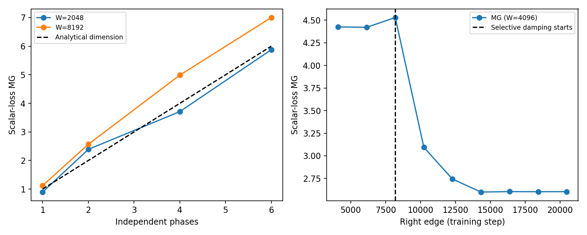

# Обучение с известным числом динамических компонент

**Результат:** реализована плотная линейная регрессия с 32 обучаемыми весами. Число независимых колебательных компонент задаётся как 1, 2, 4 или 6 и проверяется аналитически. При управляемом переходе от четырёх компонент к двум оценка по training loss снизилась с 4,97 до 2,56. Это проверка чувствительности к известному упрощению; точность абсолютной оценки пока ограничена.

## 1. Что учится и почему здесь известен ответ

Модель предсказывает скалярную метку по 32 признакам. Есть 256 обучающих примеров; обучаются **все 32 веса**, начиная с нуля:

$$
f_w(x)=x^{\mathsf T}w,\qquad y=Xw_\star,\qquad L(w)=\frac{1}{2n}\|Xw-y\|^2,\quad n=256.
$$

Матрица данных $X$ плотная и имеет полный ранг 32. Меняем не ранг цели, а число различных собственных значений гессиана $H=X^{\mathsf T}X/n$. Всегда доступны все 32 направления. Спектр разбит на $r$ групп почти одинакового размера; внутри каждой группы собственное значение одинаково. Случайный ортогональный поворот перемешивает группы в исходных координатах.

Точный рецепт: $A\in\mathbb R^{256\times32}$ и $Q\in\mathbb R^{32\times32}$ получены QR-разложением независимых стандартных гауссовских матриц; $X=\sqrt n\,A\operatorname{diag}(\sqrt{\lambda_i})Q^{\mathsf T}$. В каждой спектральной группе выбирается случайное единичное направление $u_j$ и ненулевая компонента учителя амплитуды $a_j=1/\sqrt{r\lambda_j}$. Поэтому начальный loss во всех случаях равен 0,5. Шум меток отсутствует. Отдельные 256 тестовых примеров имеют гауссовское распределение с ковариацией $H$.

Используется full-batch heavy-ball, начальный momentum нулевой:

$$
v_{t+1}=\beta v_t+\nabla L(w_t),\qquad w_{t+1}=w_t-\eta v_{t+1},\qquad \eta=1.
$$

Градиент считается через $Hw-X^{\mathsf T}y/n$: это точная алгебраическая реализация градиента MSE, а не подстановка готовых синусоид. Совпадение с прямым градиентом по данным проверено численно.

**Почему компонент ровно $r$.** Внутри каждой спектральной группы все координаты имеют одинаковую динамику. При нулевом начальном momentum вектор ошибки этой группы остаётся вдоль одного фиксированного направления. Поэтому меняются все исходные веса, но независимо колеблются лишь $r$ линейных комбинаций. Это следствие устройства задачи и обновлений, а не заморозка отдельных весов.

Для группы $j$ ошибка удовлетворяет

$$
q_{j,t+1}=(1+\beta-\eta\lambda_j)q_{j,t}-\beta q_{j,t-1}.
$$

При $\beta=1$ выбираем $\lambda_j=2(1-\cos\omega_j)$, где $\omega_j=2\pi\sqrt{p_j}/32$, а $p_j$ — первые $r$ чисел из списка 2, 3, 5, 7, 11, 13. Тогда каждая группа даёт незатухающее колебание. Частоты рационально независимы вместе с частотой дискретизации; замыкание траектории состояния «веса + momentum» — $r$-мерный тор. Это аналитический ориентир размерности, а не оценка через participation ratio. Проекция на веса также имеет размерность $r$, хотя уже не является взаимно однозначной параметризацией тора.

Периоды составляют примерно 8,9–22,6 шага. Спектр выбран специально: это контролируемый тест метода на задаче обучения. При $\beta=1$ оптимизатор колеблется вокруг решения и не сходится к нему; обычное сходящееся обучение проверяется отдельно.

## 2. Что измерялось

Для $r=1,2,4,6$ выполнено по три запуска по 12 288 шагов. Seeds 0, 1, 2 меняют плотный базис, направление учителя и тестовые примеры. **Они не дают трёх независимых динамик loss:** при фиксированном спектре и выбранных амплитудах loss одинаков с точностью до округления. Разброс между seed проверяет поворот координат и выбор скалярного наблюдателя.

Основной наблюдатель — training loss. Второй — ошибка предсказания на первом независимом тестовом примере $x_{\rm probe}^{\mathsf T}(w_t-w_\star)$. Дополнительно сохраняются все веса, координаты и momentum каждой моды, нормы и test loss. Каждая запись относится к одному и тому же шагу, до обновления параметров.

Использован существующий pooled estimator MG из статьи. Для обеих длин окна настройки одни: embedding dimension $E=16$, $k=10$ соседей, лаг $\tau=1$, исключение соседей по времени в пределах 100 шагов. Проверка устойчивости повторяет оценку при $E=32$ с тем же лагом и исключением. Окна — последние 2048 и 8192 записи; ряд действительно разрезается до вызова estimator. Каждое окно стандартизуется отдельно, dither равен $10^{-9}$ стандартного отклонения. Настройки не подбирались отдельно по известному $r$.

| Истинное число компонент | MG по loss, W=2048 | MG по loss, W=8192 | MG по probe, W=8192 | MG(32)/MG(16), loss, W=8192 |
|---|---|---|---|---|
| 1 | 0,90 | 1,12 | 1,01 | 1,00 |
| 2 | 2,39 | 2,57 | 2,55 | 1,02 |
| 4 | 3,71 | 4,99 | 4,11 | 0,88 |
| 6 | 5,88 | 7,00 | 4,98 | 1,02 |

Приведены медианы по трём seed. Полный диапазон для probe при W=8192: 1,01; 1,96–2,59; 3,57–4,25; 4,74–5,46 соответственно. Estimator различает число компонент, но имеет заметное смещение. Более длинное окно в этой серии **не обязательно улучшает точность**, а отношение около единицы не гарантирует отсутствие ошибки.

Аудит подтвердил полный ранг данных и движение всех 32 весов. Максимальное расхождение градиента с прямым вычислением по данным меньше $1,4\cdot10^{-16}$, траектории с аналитическим решением — $5,5\cdot10^{-12}$. Относительный дрейф инварианта каждой незатухающей моды меньше $2,7\cdot10^{-14}$.

## 3. Видит ли метод известное упрощение 4 → 2

Начинаем с четырёх мод. На шаге 8192 включаем затухание momentum с коэффициентом 0,98 только в двух спектральных группах; в остальных сохраняем коэффициент 1. В исходных координатах это плотный оператор. Данные, loss и число обучаемых весов не меняются. Это **явное вмешательство в оптимизатор**, использующее известные группы; estimator этих групп не видит.

Сравниваем два непересекающихся окна по 8192 записи: шаги 0–8191 и 12288–20479. Переходный участок исключён. Две подавленные моды в позднем окне достигают численного пола, их инварианты относительно начальных значений порядка $10^{-31}$; две оставшиеся сохраняют амплитуды. Строгое число фаз позднего предельного движения — 2; в конечное время это утверждение о практически неразличимых остатках затухающих мод.

| Наблюдатель | До подавления: 4 компоненты | После подавления: 2 компоненты |
|---|---|---|
| Training loss, MG | 4,97 | 2,56 |
| Ошибка на probe, медиана MG | 4,15 | 2,63 |
| MG(32)/MG(16) для loss | 0,88 | 1,02 |

**Контроль изменения масштаба:** умножение исходного четырёхкомпонентного loss на 0,01 оставило MG равным 4,99. Это ожидаемый контроль стандартизации, а не отдельное обучение. Падение при подавлении мод не объясняется одним лишь уменьшением общего масштаба ряда.

График перехода использует окно 4096; точка подписана правой границей окна. Стрелки и кривые не означают мгновенное обнаружение: первые окна после вмешательства смешивают два режима.

## 4. Где заканчивается положительный вывод

В дополнительном контроле обычный скалярный momentum $\beta=0,99$ затухает во всех направлениях и регрессия сходится. Ранние длинные окна получают флаг вырожденности. В позднем окне loss колеблется на уровне численного округления: стандартное отклонение порядка $10^{-31}$. После стандартизации estimator всё же возвращает MG около 7,1–7,5 и не всегда ставит флаг вырожденности. Это **не размерность обученной системы**, а численный артефакт. Значит, необходим контроль абсолютного масштаба до стандартизации; текущего флага недостаточно.

Получен контролируемый пример настоящего обучения по данным, в котором число независимых фаз известно и scalar log реагирует на его уменьшение. Но спектр специально сконструирован, режим без затухания не сходится, а упрощение внесено вручную. Поэтому этот опыт подтверждает чувствительность метода к известному упрощению, но ещё не доказывает практическую универсальность или спонтанное упрощение нейросетевого обучения. Для этого нужен отдельный эксперимент со сходящимся оптимизатором и независимой проверкой мод.

## Воспроизведение

Из корня проекта: `python research_known_modes.py`. Скрипт сохраняет полные траектории NPZ, `measurements.csv`, `stationary_summary.csv`, `audits.csv`, `amplitude_control.csv`, параметры в `metadata.json` и график. Сборка этого отчёта: `python research_known_modes_results/build_report.py`. Прежние результаты факторизации не перезаписываются.

Математический ориентир выше выведен для данной постановки. Общий контекст спектрального анализа heavy-ball на квадратичных задачах: Scieur and Pedregosa, “Universal Average-Case Optimality of Polyak Momentum”, ICML 2020, PMLR 119:8565–8572. Наша граница $\beta=1$ и управляемое подавление мод — отдельная конструкция, а не следствие теоремы о скорости сходимости из этой работы.
