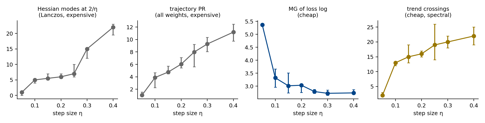
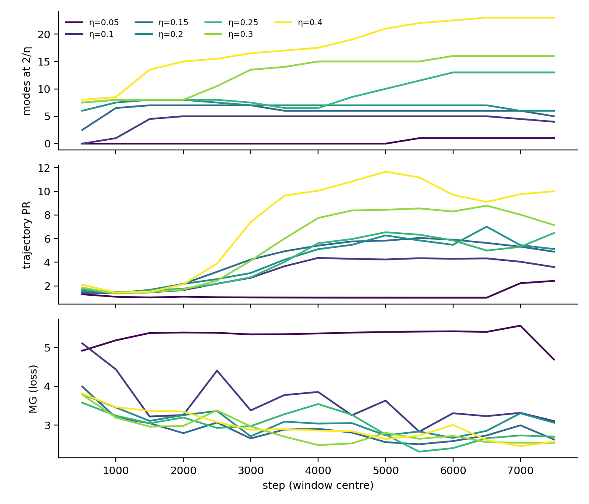
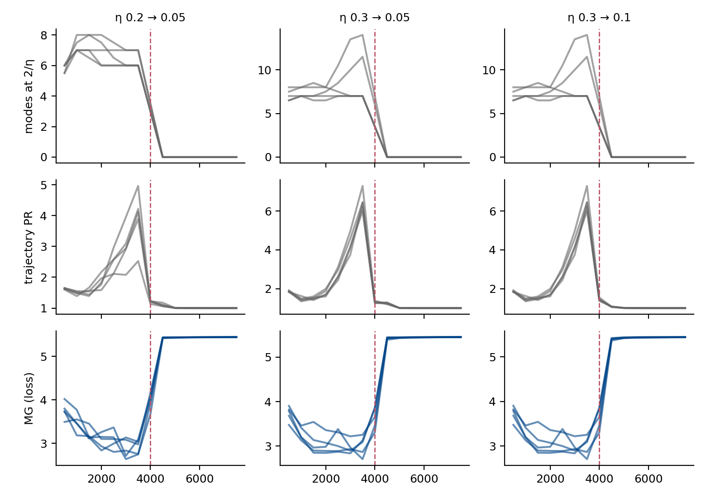

# E2. Edge of stability: считает ли MG по логу loss число колеблющихся мод?

29.09.2026. Локальный CPU-эксперимент, 35 + 15 запусков, около 20 минут.

**Короткий итог.** Заранее зафиксированная гипотеза опровергнута: MG по полнобатчевому
loss **не считает** число мод Гессиана на пороге устойчивости. Он с ним
**антикоррелирует**: ρ = −0.83 по запускам, −0.73 по окнам. При переходе через
границу edge of stability и при выходе из неё MG меняется сильно и воспроизводимо,
то есть смену режима видит. Но направление изменения противоположно размерностной
интерпретации, а простые статистики лога (trend crossings, доля шагов с ростом loss)
видят то же событие с правильным знаком и дешевле. Положительным примером для
тезиса «MG — дешёвый анализатор упрощения» этот эксперимент не является.

---

## 1. Мотивация

Предыдущий пилот (`README.md`, §1–3) показал две вещи.

1. Под SGD MG по логу — функция одного спектра: MG / MG_IAAFT ≈ 0.98. Упрощение
   траектории он ловит только через изменение спектра, и trend crossings делают то же.
2. В полнобатчевом режиме на edge of stability лог детерминированный:
   MG / MG_IAAFT = 0.51–0.66. MG там устойчив к сглаживанию наблюдателя, а
   спектральные статистики — нет. Это единственный режим реального обучения, где
   теория статьи в принципе применима и у MG есть шанс сделать то, чего не делают
   дешёвые конкуренты.

E2 проверяет этот режим прямо. Нужна дорогая «правда» о числе активных направлений и
вмешательство, которое это число меняет.

**Почему edge of stability.** Полнобатчевый градиентный спуск с шагом η поднимает
верхние собственные значения Гессиана до порога 2/η и держит их там (Cohen et al.,
2021, *Gradient descent on neural networks typically occurs at the edge of
stability*). Каждое направление, чья кривизна стоит на пороге, колеблется.
Разведочный скан (только Гессиан и loss, MG не считался) показал, что в нашей сети
таких мод несколько и их число растёт с η: около 5 при η = 0.1, около 7 при 0.2, до
15–24 при 0.3–0.5. Это естественный и независимо измеряемый аналог «числа активных
компонент» в реальном обучении, и его можно менять шагом.

**Гипотеза (зафиксирована в `eos.py` до запуска):** MG полнобатчевого loss растёт
вместе с числом мод на пороге и с PR траектории весов, а при уменьшении η, когда
моды уходят с порога, падает.

## 2. Постановка

**Сеть и данные.** MLP 64 → 64 → 64 → 10 с tanh, 8 970 параметров; sklearn digits,
все 1 797 изображений 8 × 8. Одна задача, классификация цифр.

**Обучение.** MSE до one-hot целей, полнобатчевый градиентный спуск без momentum,
8 000 шагов, 5 сидов. MSE выбран, как у Cohen et al.: с cross-entropy на разделимых
данных кривизна падает по мере роста зазоров. Мы это проверили: при η = 1 CE-запуск
сходится к loss 6·10⁻⁴ без мод на пороге, при η = 4 взрывается.

**Два этапа.**

- *sweep*: постоянный η ∈ {0.05, 0.1, 0.15, 0.2, 0.25, 0.3, 0.4}. При η ≥ 0.7
  обучение расходится.
- *switch*: на шаге 4 000 η уменьшается: 0.3 → 0.1, 0.3 → 0.05, 0.2 → 0.05.
  Контроль — постоянные η из sweep. Обратный переход 0.1 → 0.3 расходится во всех
  пяти сидах через 20 шагов после переключения; это записано и не скрыто.

**Дорогие эталоны.**

- `n_unstable` — число собственных значений Гессиана полнобатчевого loss не ниже
  0.9 · 2/η. Считается Ланцошем (`scipy eigsh`, 24 верхних значения, ~63 умножения
  Гессиана на вектор) на чекпойнте каждые 250 шагов. Для устойчивости выводов есть
  варианты с порогом 0.97 и 0.8.
- `traj_PR` — detrended participation ratio траектории **всех** весов в окне из
  1 000 шагов. Нужно хранить 8 970 чисел на каждом шаге.

**Дешёвая статистика (зафиксирована заранее).** MG полнобатчевого loss, который
обучение и так вычисляет: E = 10, τ = 1, k = 10, исключение Тейлера на размах
вектора задержек, окно 1 000, шаг 500. К каждому окну:

- MG трёх IAAFT-суррогатов — показывает, есть ли в логе нелинейная структура;
- MG при E = 20 — отношение идентифицируемости из статьи;
- MG того же лога, сглаженного скользящим средним по 16 шагам — контроль
  наблюдателя: траектория та же, лог другой;
- простые конкуренты: trend crossings, доля шагов с ростом loss, спектральная
  энтропия, автокорреляция на лаге 1.

Первые 2 000 шагов (выход на порог) в сравнение уровней не входят.

## 3. Результаты

### 3.1. Sweep: MG антикоррелирует с числом мод



Медиана по 5 сидам, окна после шага 2 000:

| η | моды на 2/η | PR траектории | **MG** | MG / суррогат | идентиф. E20/E10 | trend crossings | доля роста loss |
|---|---|---|---|---|---|---|---|
| 0.05 | 1 | 1.05 | **5.37** | 0.99 | 1.71 | 2 | 0.00 |
| 0.10 | 5 | 3.89 | **3.32** | 0.88 | 1.36 | 13 | 0.40 |
| 0.15 | 5.5 | 4.76 | **3.01** | 0.83 | 1.31 | 15 | 0.42 |
| 0.20 | 6 | 6.03 | **3.03** | 0.75 | 1.35 | 16 | 0.45 |
| 0.25 | 7 | 7.99 | **2.79** | 0.87 | 1.29 | 19 | 0.46 |
| 0.30 | 15 | 9.28 | **2.72** | 0.81 | 1.31 | 20 | 0.46 |
| 0.40 | 22 | 11.19 | **2.74** | 0.84 | 1.29 | 22 | 0.46 |

Ранговые корреляции со вторым и третьим столбцами:

| статистика | ρ с модами, по запускам (n = 35) | ρ с модами, по окнам | ρ с PR траектории, по запускам |
|---|---|---|---|
| **MG** | **−0.83** | **−0.73** | **−0.79** |
| MG суррогата | −0.63 | −0.47 | −0.61 |
| trend crossings | **+0.90** | +0.67 | **+0.92** |
| доля роста loss | +0.82 | +0.72 | +0.82 |
| спектральная энтропия | +0.82 | +0.52 | +0.89 |

Оба дорогих эталона согласованы друг с другом и монотонно растут с η. MG падает:
сначала резко (5.4 → 3.3), когда появляется edge of stability, затем полого
(3.3 → 2.7), когда мод становится больше. Самый простой счётчик — число пересечений
тренда — ранжирует режимы правильно и лучше MG.

По отношению идентифицируемости из статьи (1.29–1.71 при допустимой полосе ≤ 1.1)
ни одно окно не проходит как «размерность». То есть собственная диагностика метода
правильно предупреждает, что уровень MG здесь размерностью читать нельзя. MG /
суррогат при этом 0.75–0.88: нелинейная структура в логе есть, но это не та
геометрия, которую предполагает теорема.

### 3.2. Внутри одного запуска

Прогрессивное заострение постепенно выводит моды на порог, и в пределах запуска их
число растёт со временем. Медианная корреляция Спирмена по 35 запускам:

| статистика | ρ с модами | ρ с PR траектории |
|---|---|---|
| MG | −0.53 | −0.66 |
| trend crossings | +0.01 | −0.70 |
| доля роста loss | +0.31 | +0.31 |

Знак у MG тот же — обратный.



### 3.3. Switch: выход из edge of stability MG видит, но с обратным знаком



Отношение после/до переключения, медиана по сидам:

| переход | Δ мод | PR траектории | **MG** | MG / суррогат | trend crossings |
|---|---|---|---|---|---|
| 0.3 → 0.1 | −7 | 0.24 | **1.83** | 1.25 | 0.07 |
| 0.3 → 0.05 | −7 | 0.24 | **1.84** | 1.28 | 0.07 |
| 0.2 → 0.05 | −6 | 0.34 | **1.79** | 1.31 | 0.09 |
| контроли 0.1 / 0.2 / 0.3 | 0 … +2 | 1.6 … 2.4 | 0.89 … 0.96 | ~1 | 0.55 … 0.79 |

После уменьшения шага все моды уходят с порога, колебания гаснут, PR траектории
падает в 3–4 раза. MG почти удваивается, и **знак совпадает с эталоном только в 11 %
пар «запуск × эталон»** (у crossings — 51 %). Событие детектируется надёжно:
разница с контролями огромна во всех 15 запусках. Но по MG выходит, что «стало
сложнее», хотя стало проще.

Причина видна по диагностикам. После переключения лог — гладкий монотонный спуск:
crossings падают до ~0, доля роста loss равна 0, MG / суррогат > 1. Это транзиент, и
MG выходит на одно и то же значение ≈ 5.4 во всех сидах. Это тот же артефакт, что
§6.1 статьи описывает для затухающего запуска («≈ 16» при большем исключении): число
на транзиенте — свойство конфигурации оценщика, а не размерность. Диагностики его
правильно отметили бы как неинтерпретируемое.

### 3.4. Контроль наблюдателя

Сглаживание лога на 16 шагов почти ничего не меняет ни у MG (×0.99), ни у простых
статистик (crossings ×1.00, энтропия ×0.97). Здесь контроль малоинформативен: на
edge of stability медленная огибающая не зависит от сглаживания, а колебание с
периодом 2 гасится одинаково для всех. Ранговая корреляция MG со сглаженного лога с
модами — −0.91, то есть тот же обратный знак.

### 3.5. Постфактум-варианты (не были зафиксированы заранее)

Лог loss на edge of stability каждый шаг меняет знак отклонения. Проверили, не
мешает ли это: убрали колебание перед вложением, варианты перечислены все, выбора по
результату не было (`eos_posthoc.py`):

| вариант | ρ по запускам | ρ только EoS-запуски | ρ по окнам |
|---|---|---|---|
| τ = 1 (заранее зафиксированный) | −0.83 | −0.73 | −0.73 |
| τ = 2 | −0.90 | −0.83 | −0.73 |
| только чётные / нечётные шаги | −0.82 / −0.84 | −0.71 / −0.75 | −0.64 |
| среднее соседних пар | −0.83 | −0.73 | −0.64 |
| адаптивный лаг | −0.92 | −0.90 | −0.74 |
| демодуляция (−1)ᵗ · остаток | +0.39 | **+0.82** | +0.17 |

Только демодулированный вариант даёт положительный знак, и только между запусками
в режиме EoS. Динамический диапазон крошечный: 2.31 → 2.57 при росте числа мод с 5
до 22. Окно к окну связи почти нет (ρ = 0.17). Как счётчик мод это не работает, и
выбирать вариант постфактум мы не стали бы в любом случае.

### 3.6. Стоимость

| измерение | время / объём |
|---|---|
| MG одного окна лога (1 000 точек) | **6.7 мс** |
| PR траектории одного окна | 295 мс + хранение **274 МБ** весов на запуск |
| Ланцош на чекпойнт (63 HVP) | 93 мс; 3.2 с на запуск при обучении 7.6 с |
| лог loss | 31 КБ, вычисляется обучением бесплатно |

По цене MG выигрывает в 14–44 раза и на четыре порядка по памяти. Но выигрыш по цене
имеет смысл только при правильном сигнале, а здесь сигнал с обратным знаком.
Trend crossings — один проход по окну, их время отдельно не мерилось; знак у них правильный.

## 4. Интерпретация

1. **MG по логу loss меряет не число колеблющихся направлений параметров.** Loss —
   одна квадратичная функция отклонений по всем модам сразу. Когда мод больше, их
   вклады в скаляр усредняются, и лог становится *менее* структурированным,
   ближе к гауссовскому шуму, а не более многомерным в смысле delay-вложения. Условие
   теоремы о вложении (детерминированная динамика на компактном инвариантном
   множестве низкой размерности) на EoS формально выполнено, но множество
   высокоразмерное (по PR траектории 4–11, по модам 5–22). При E = 10 и окне в 1 000
   точек его не разрешить, а потолок статьи — около 8. Отношение идентифицируемости
   1.3 об этом и предупреждает.
2. **Как детектор смены режима MG работает, но не как детектор упрощения.** Вход в
   EoS и выход из него дают большое воспроизводимое изменение MG. Направление при
   этом отражает переход «колебания ↔ транзиент», а не «больше ↔ меньше
   компонент». То же событие дешевле и однозначнее видят trend crossings и доля
   шагов с ростом loss.
3. **Диагностики статьи отработали правильно.** Во всех окнах, где читать уровень
   нельзя, они это показали: отношение идентифицируемости > 1.1 везде, crossings ≈ 0
   на транзиенте. Это аргумент за обязательность диагностик, но не за MG как
   измеритель.

## 5. Что это значит для статьи

- Формулировку «на реальном обучении MG — дешёвый анализатор упрощения, *и
  меньшее MG значит проще*» этот эксперимент **не поддерживает**. Направление
  связи зависит от режима: под SGD оно правильное, но только через спектр; на EoS
  оно обратное.
- Честная формулировка, которая выдерживает оба эксперимента: **MG — дешёвый
  детектор смены динамического режима лога; насколько его значение можно читать как
  размерность, говорят отношение идентифицируемости и отношение к суррогату, и в
  реальном обучении они пока ни разу не прошли**.
- Единственный реальный случай, где падение MG совпало с независимо измеренным
  упрощением траектории и прошло суррогатный тест, — grokking (§7.3 статьи). Это
  флагман. Следующий эксперимент — расширить именно его (E1 из `README.md`):
  сиды, задачи, MG / суррогат по окнам вокруг t_gen, тот же эталон PR траектории.
- Если нужен ещё один «дорогой ↔ дешёвый» пример, то только с эталоном «PR
  траектории весов», как здесь. Метрики представлений (NC, RankMe) для этого не
  подходят. И в каждом отчёте — все контроли: сглаживание, масштаб, амплитуда.

## 6. Ограничения этого эксперимента

- Одна маленькая сеть (9 тыс. параметров), одна задача, одна функция потерь. На
  больших сетях мод на пороге может быть меньше или больше. Результат не обобщать
  на «EoS вообще».
- Число мод — порог 0.9 · 2/η по 24 верхним собственным значениям; при η = 0.4 оно
  упирается в k = 24. Вывод об антикорреляции от порога не зависит: при пороге 0.97
  ρ = −0.82.
- Конфигурация MG (E = 10, τ = 1, окно 1 000) взята из пилота и не подбиралась здесь.
  Подбор постфактум (§3.5) знака не исправил.
- Переход 0.1 → 0.3 расходится, поэтому «усложнение» в switch-этапе не проверено.

## 7. Воспроизведение

```sh
cd 2026-Project-202
python research_trajectory_reference/eos.py --stage all      # ~20 мин, CPU
python research_trajectory_reference/eos_analyse.py          # таблицы и рисунки
python research_trajectory_reference/eos_posthoc.py          # §3.5
```

Файлы в `results_eos/`:

- `windows_all.csv` — все окна со всеми статистиками;
- `checkpoints_all.csv` — 24 верхних собственных значения на каждом чекпойнте;
- `summary.json` — все числа этого отчёта;
- `posthoc_summary.csv` — варианты §3.5;
- `log_*.npz` — сырые логи loss;
- `figures/` — рисунки.
