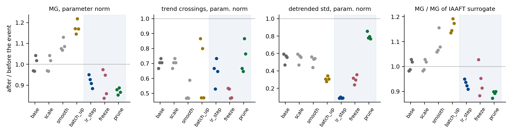
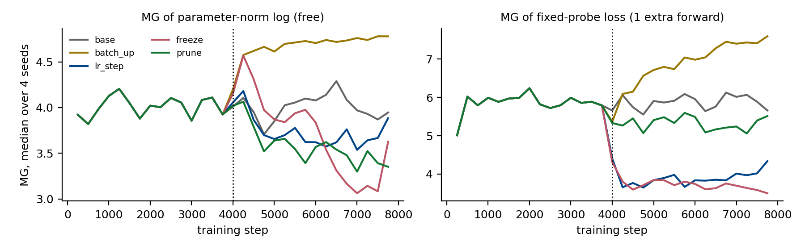

# E4. Практические события упрощения при обучении CNN на CIFAR-10: видит ли их MG по логу?

29.09.2026. Локальный CPU-эксперимент, 20 запусков, около 55 минут.

## Итог

**Первый положительный прикладной пример.** В обучении обычной CNN на CIFAR-10
заложены три стандартных события, упрощающих оптимизацию: ступенчатый спад learning
rate, заморозка бэкбона и магнитудный прунинг 80 % весов. MG по логу **нормы
параметров** — лога, который не требует ни одного лишнего прохода сети, —
регистрирует все три.

- **Сигнал.** MG падает на 8–13 % против нуля в контроле. Разделение событий и
  контролей: AUC 0.98, 4 сида × 5 рукавов.
- **Ложные тревоги.** Ни один из четырёх контролей MG за упрощение не выдаёт:
  обучение без события, меньший шум градиента, масштаб лога, сглаживание лога.
- **Конкуренты.** Простые статистики того же лога событие почти не видят:
  trend crossings AUC 0.64, автокорреляция 0.41, относительный разброс 0.58.
- **Нелинейная структура.** MG не сводится к спектру: MG / MG_IAAFT = 0.80, и это
  отношение само смещается при событиях (AUC 0.97).

**Оговорки.**

- Как размерность число читать нельзя: отношение идентифицируемости 1.6. Это
  относительный сигнал «до/после».
- Эффект небольшой: одно из 12 значений событийных рукавов касается диапазона
  контроля.
- Сравнение с конкурентами на логе нормы проведено после основного анализа, оно
  дополнительное.
- На логах loss MG тоже видит события (AUC 1.0), но там он повторяет спектральные
  статистики, и сглаживание лога даёт ложную тревогу.

## 1. Мотивация

В двух предыдущих экспериментах выяснилось:

- под SGD MG по логу loss — функция одного спектра (MG ≈ MG суррогата);
- на edge of stability MG антикоррелирует с числом колеблющихся мод
  (`REPORT_E2_ru.md`).

Цель этого эксперимента скромнее и практичнее: собрать **прикладной пример, где MG
просто работает**. То есть он дёшево регистрирует момент, когда система заведомо
упростилась, а само упрощение установлено независимо. Выигрыш у существующих
измерителей желателен, но не обязателен.

Мы выбрали события, которые в практике обучения встречаются постоянно и для которых
упрощение известно **по построению**, без дорогих измерений:

| событие | что упрощается | независимое подтверждение |
|---|---|---|
| **lr_step** — learning rate ÷ 10 | шаг и шум оптимизации в 10 раз меньше | задано расписанием |
| **freeze** — учится только линейная голова | движущихся параметров 14 666 → 330 (в 44 раза меньше) | по построению |
| **prune** — прунинг 80 % весов по модулю | ненулевых весов в 5 раз меньше | по построению, проверено в конце запуска |

Контроли, **где упрощения нет**:

- **base** — обучение без события;
- **batch_up** — батч 64 → 256: шум градиента меньше, но двигаются те же параметры
  и с тем же шагом;
- **scale** — лог base после середины умножен на 10;
- **smooth** — лог base после середины сглажен скользящим средним по 16 шагам:
  траектория та же, изменился только наблюдатель.

## 2. Постановка

Протокол записан в docstring `cifar_events.py` до первого запуска.

**Данные.** CIFAR-10, официальные батчи. 10 000 обучающих изображений, по 1 000 на
класс, фиксированное разбиение, seed 20260929. Тестовая точность — по 2 000
изображениям официального test.

**Модель.** CNN: conv 3→16, ReLU, maxpool; conv 16→32, ReLU, maxpool; conv 32→32,
ReLU, global average pool; linear 32→10. Всего 14 666 параметров.

**Обучение.** SGD с momentum 0.9, weight decay 5·10⁻⁴, lr 0.02, батч 64 с
возвращением, 8 000 шагов. Событие — на шаге 4 000. Сиды 0–3. Тестовая точность в
конце — 0.61–0.64 во всех рукавах, так что ни одно событие обучение не ломает.

**Логи, записываемые на каждом шаге:**

- loss мини-батча — бесплатен, обучение его и так считает;
- loss на фиксированных 100 обучающих изображениях — нужен один дополнительный
  прямой проход;
- норма градиента;
- норма параметров — вычисляется по уже имеющимся весам за O(P), прохода сети не
  требует.

**MG.** Конфигурация взята из пилота и заранее зафиксирована: E = 10, τ = 1, k = 10,
исключение Тейлера на размах вектора задержек, окно 500 шагов, шаг окон 250. К
каждому окну считаются MG при E = 20 (отношение идентифицируемости) и медиана MG трёх
IAAFT-суррогатов.

**Конкуренты.** Trend crossings, автокорреляция остатка на лаге 1, относительный
detrended std.

**Основное сравнение.** Для каждого запуска — отношение медианы по окнам после
события (начало ≥ 4 500) к медиане до события (окна внутри [2 000, 4 000)).
Разделение «события против контролей base и batch_up» оценивается AUC: доля пар, в
которых отношение у события меньше.

## 3. Что не сработало: PR траектории как эталон

Протоколом в качестве дорогого эталона был заложен detrended PR траектории **всех**
весов в окне из 500 шагов — 448 МБ весов на запуск. На CIFAR он почти не реагирует
ни на одно событие: отношение после/до от 0.90 до 1.05, а на заморозке — 0.92,
хотя двигаться продолжают 330 параметров из 14 666.

Причина проверена моделированием. Detrended PR **чистого случайного блуждания** на
500 шагах равен ≈ 5.0 и не зависит от размерности пространства: 5.08 при P = 330,
5.03 при 2 933, 5.04 при 14 666. Под SGD траектория весов на таком окне близка к
блужданию, и её PCA даёт «размерность» самой формы блуждания (известный эффект:
Antognini & Sohl-Dickstein, 2018, *PCA of high dimensional random walks*), а не
число движущихся направлений.

Следствие: **для SGD-обучения оконный PR траектории — не эталон размерности.**
Поэтому ниже упрощение подтверждается построением события. Это стоит учесть и в
статье: §7.2 опирается на тот же статистик, хотя там AdamW и окно в 600 шагов, и
коллапс по величине намного больше.

## 4. Результаты

### 4.1. Лог нормы параметров: MG видит все три события



Отношение после/до, медиана по 4 сидам и диапазон [мин; макс]:

| рукав | **MG** | trend crossings | detrended std | MG суррогата | **MG / суррогат** |
|---|---|---|---|---|---|
| base | **0.99** [0.97; 1.04] | 0.71 | 0.56 | 1.00 | 1.00 |
| scale | **0.99** [0.97; 1.04] | 0.71 | 0.56 | 1.00 | 1.00 |
| smooth | **1.08** [1.07; 1.13] | 0.47 | 0.54 | 1.00 | 1.07 |
| batch_up | **1.17** [1.15; 1.22] | 0.64 | 0.31 | 1.00 | 1.16 |
| lr_step | **0.92** [0.88; 0.95] | 0.66 | 0.09 | 0.99 | 0.93 |
| freeze | **0.90** [0.84; 0.97] | 0.50 | 0.31 | 0.94 | 0.93 |
| prune | **0.87** [0.85; 0.89] | 0.72 | 0.79 | 0.96 | 0.90 |

AUC «отношение ниже у события, чем у base и batch_up»:

| статистика | AUC |
|---|---|
| **MG** | **0.98** |
| MG / суррогат | 0.97 |
| MG суррогата | 0.88 |
| отношение идентифицируемости | 0.75 |
| trend crossings | 0.64 |
| detrended std | 0.58 |
| автокорреляция лаг 1 | 0.41 |

- **Все 12 значений событийных рукавов ниже 0.97**, все 8 значений контролей base и
  batch_up — не ниже 0.97. Граница касается в одной точке: сид заморозки с 0.97
  против минимума base 0.97.
- **Ложных тревог нет.** Меньший шум (batch_up) и сглаживание лога сдвигают MG
  **вверх** (1.17 и 1.08), масштаб не меняет ничего.
- **Простые статистики события не отделяют.** Crossings и std сильно меняются и в
  контролях: std лога нормы падает вдвое даже в base, потому что норма растёт всё
  медленнее. Особенно показательны prune (std 0.79, почти как в контроле) и smooth
  (crossings 0.47 — сильнее всех событий).
- **Изменение MG не спектральное.** У суррогата с тем же спектром сдвиги гораздо
  меньше (0.94–0.99), а MG / суррогат на уровне 0.80 и сам смещается при событиях.
  В логе нормы есть нелинейная структура, и MG реагирует именно на неё. Это отличает
  этот результат от всех прошлых под SGD.



Временные ряды показывают, что сигнал медленный. На заморозке MG сначала на пару
окон подскакивает (переходный процесс), потом опускается. Base тоже колеблется
(3.7–4.3), поэтому детектор по одному окну был бы шумным. Работает сравнение медиан
за ~2 000 шагов до и после события.

### 4.2. Логи loss: события видны, но только через спектр

Отношение после/до, медиана по сидам:

| рукав | MG probe loss | MG суррогата | trend crossings | MG loss мини-батча |
|---|---|---|---|---|
| base | 1.01 | 0.98 | 1.03 | 1.01 |
| batch_up | 1.22 | 1.21 | 1.42 | 0.99 |
| lr_step | 0.67 | 0.65 | 0.35 | 1.00 |
| freeze | 0.63 | 0.62 | 0.28 | 1.01 |
| prune | 0.90 | 0.89 | 0.85 | 1.00 |
| **smooth** | **0.66** ✗ | 0.65 | 0.23 | 0.67 |

- **Probe loss.** События отделяются идеально (AUC 1.0), но так же идеально
  отделяют их суррогатный MG, trend crossings и std (у всех AUC 1.0).
  MG / суррогат = 1.00: вся информация в спектре. Сглаживание лога даёт ложную
  тревогу ×0.66, как и в пилоте. Кроме того, probe loss не бесплатен: 58 с
  дополнительных прямых проходов против 78 с самого обучения.
- **Loss мини-батча** (бесплатный) не реагирует ни на что: 0.99–1.01. Его колебания
  задаёт выборка батча, а не динамика параметров.

### 4.3. Стоимость

| что | цена |
|---|---|
| MG одного окна лога | **4.8 мс** |
| лог нормы параметров | O(P) на шаг, без прохода сети; 31 КБ на запуск |
| лог probe loss | один прямой проход на шаг: +75 % ко времени обучения этой сети |
| PR траектории одного окна | 183 мс и хранение **448 МБ** весов на запуск (и, как выяснилось, не эталон) |
| Ланцош по Гессиану (из E2) | ~100 мс и 60+ HVP на чекпойнт |

## 5. Интерпретация

1. **Какой лог брать — принципиально.** Loss мини-батча — шум выборки. Probe loss —
   сглаженная функция параметров, его MG — спектральная сводка. Норма параметров —
   медленная детерминированная функция всей траектории, в ней остаётся нелинейная
   структура, и на ней MG даёт то, чего не дают простые статистики. Это
   согласуется со статьёй: в §7.3 у grokking'а работает тоже лог нормы параметров.
2. **Что именно ловится.** Все три события уменьшают число или «подвижность»
   направлений, по которым идёт траектория. Меньший шум при тех же направлениях
   (batch_up) даёт противоположный знак. То есть MG реагирует не на амплитуду, а на
   структуру движения. Это совместимо с размерностной интерпретацией из теории, но
   не доказывает её: отношение идентифицируемости 1.6 говорит, что абсолютный
   уровень размерностью не является.
3. **Детектор, а не измеритель.** Честная форма утверждения: MG по бесплатному
   логу нормы параметров надёжно (4/4 сида, AUC 0.98) и без ложных тревог в наших
   контролях отмечает стандартные события упрощения обучения, а простые статистики
   того же лога этого не делают.

## 6. Ограничения

- **Размер.** Одна маленькая CNN (15 тыс. параметров), 10 тыс. изображений CIFAR-10,
  4 сида, 8 000 шагов. Нужна проверка на ResNet / полном CIFAR (Colab GPU).
- **Размер эффекта.** 8–13 %, границы событие/контроль касаются в одной точке.
- **Порядок анализа.** Основными наблюдателями в протоколе были loss-логи. MG по
  норме параметров протоколом вычислялся, но конкуренты на этом логе посчитаны
  после основного анализа (`cifar_paramnorm.py`). Следующий эксперимент должен
  зафиксировать норму параметров как основного наблюдателя заранее.
- **Эталон.** Дорогой эталон, заложенный протоколом (PR траектории), под SGD
  оказался неинформативным (§3). Упрощение подтверждено построением событий, а не
  измерением. Для lr_step «упрощение» — это уменьшение шага и шума, а не числа
  направлений.
- **Сигнал медленный.** Нужно ~2 000 шагов после события; по одному окну детектор
  шумный.

## 7. Что дальше

1. **Повтор с заранее зафиксированным основным наблюдателем — нормой параметров** —
   на ResNet-18 / полном CIFAR-10 (Colab). Те же события плюс практические
   варианты: косинусное расписание, постепенный прунинг, fine-tuning
   предобученной модели с заморозкой.
2. **Детектор момента события.** Порог по MG в скользящих окнах, заданный до
   запуска, и сравнение времени срабатывания с реальным моментом события.
3. **Другие бесплатные логи:** нормы отдельных слоёв, норма обновления. Вероятно, по
   норме слоя можно локализовать, **какой** слой упростился.
4. **Эталон под SGD.** Вместо оконного PR траектории брать PR ковариации
   *обновлений* Δθ (у неё нет артефакта блуждания) или число параметров,
   сдвинувшихся заметнее шума.

## 8. Воспроизведение

```sh
cd 2026-Project-202
python research_trajectory_reference/cifar_events.py      # ~55 мин, CPU; путь к CIFAR в DATA
python research_trajectory_reference/cifar_analyse.py     # логи loss, summary.json
python research_trajectory_reference/cifar_paramnorm.py   # лог нормы параметров, конкуренты
```

Файлы в `results_cifar/`:

- `windows.csv` — окна логов loss;
- `paramnorm_windows.csv`, `paramnorm_ratios.csv` — лог нормы параметров;
- `summary.json`, `meta.json` — сводка и метаданные запусков;
- `logs_*.npz` — все сырые логи;
- `figures/` — рисунки.
